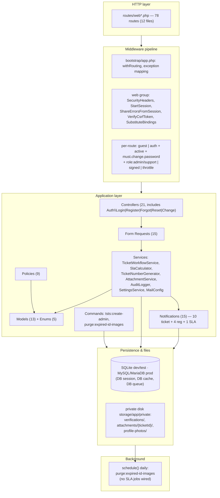
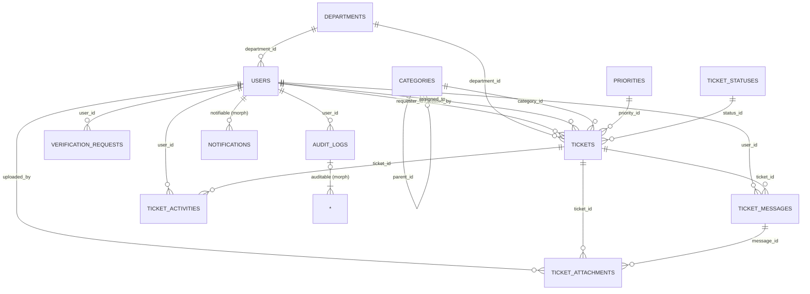
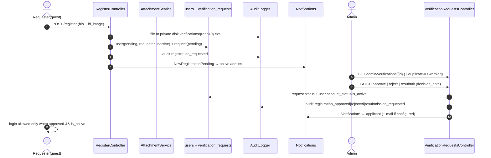
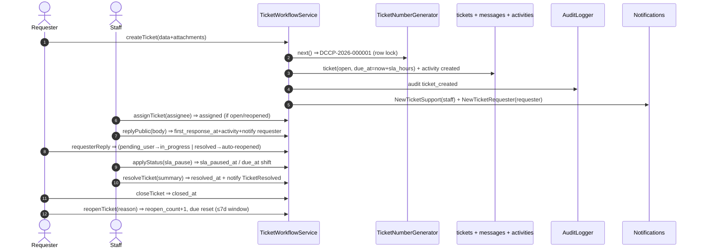
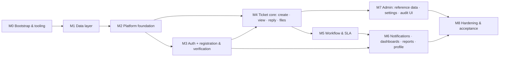

# PROMPT_LOGS

Reverse-engineering log for **Tech Support Ticketing System (TSTS) — Data Center College of the Philippines - Bangued**.

This file is the running record of a phased reverse-engineering analysis of the existing Laravel source code in this repository, intended to let the system be rebuilt from scratch, part by part.

---

## GROUND RULES (agreed)

1. **Evidence only.** Every claim must cite its source (file path + function/class name). Never invent features. Unclear/missing items are marked `[UNKNOWN]` and collected under "Questions for me".
2. **One phase per response.** Finish the current phase, then stop and wait for "continue" (or corrections). Do not jump ahead.
3. **Be exhaustive before being concise.** Include config, validation, error handling, logging, background jobs, migrations, scripts.
4. **Describe WHAT and WHY**, not just HOW. Capture business rules and edge cases, not only code structure.
5. If too large for one pass, split by module/directory and process in chunks with a running summary.
6. End every phase with (a) a **Carry-Forward Summary** (≤300 words) and (b) **Questions for me**.

---

## SOURCE MATERIAL IN SCOPE

Only the source tree of this repository (`C:\Desktop\DCCP-Bangued Technical Support Ticketing System`) is treated as evidence. AI/dev tooling (`.ai/`, `.agents/`, `.claude/`, `CLAUDE.md`, `AGENTS.md`, `boost.json`, `opencode.json`, `.mcp.json`, `.tmp-verify/`) is **not** application runtime.

---

## PROGRESS INDEX

| Phase | Title | Status |
| --- | --- | --- |
| 0 | Reconnaissance — System Snapshot | COMPLETE |
| 1 | Feature Extraction — Feature Catalog | COMPLETE |
| 2 | Architecture and Data | COMPLETE |
| 3 | Rebuild Roadmap | COMPLETE |
| 4 | Build Prompts (one per phase) | COMPLETE |
| 5 | Verification | COMPLETE |

---

# PHASE 0 — SYSTEM SNAPSHOT

## 0.1 What this is
A **server-rendered Laravel monolith** (no API surface, no SPA): an internal **IT helpdesk / technical-support ticketing system** for *Data Center College of the Philippines – Bangued*. Users submit support tickets, staff triage/assign/resolve them, admins manage reference data, users, verification of registrations, audit logs and reports. Evidence: `README.md:12`, `config/tsts.php:14-30`, `routes/web/*.php`.

> Note: the workspace also holds AI-tooling files (`.ai/`, `.agents/`, `.claude/`, `CLAUDE.md`, `AGENTS.md`, `boost.json`, `opencode.json`, `.mcp.json`, `.tmp-verify/`). These are **development/agent tooling, not application runtime**.

---

## 0.2 Languages, frameworks, runtime, package managers

| Item | Value | Evidence |
|---|---|---|
| Language | PHP **8.5.8** (cli, ZTS, VC++ 2022 x64) | `php -v`; `composer.json:9` requires `^8.3` |
| Framework | **Laravel 13.32.0** | `composer show --direct`; `composer.json:10` `^13.17` |
| Architecture | Laravel 13 slim skeleton (`bootstrap/app.php` config style; no `app/Http/Kernel.php`, no `RouteServiceProvider`) | `bootstrap/app.php`, `bootstrap/providers.php` |
| Node | **v24.19.0**; npm **11.17.0** | `node -v`, `npm -v` |
| PHP package manager | Composer (lockfile committed) | `composer.json`, `composer.lock` |
| JS package manager | npm (lockfile committed, `.npmrc` present) | `package.json`, `package-lock.json`, `.npmrc` |
| Frontend build | **Vite 8** + `laravel-vite-plugin` 3 + **Tailwind CSS 4** (`@tailwindcss/vite`) | `vite.config.js`, `package.json:10-14` |
| JS runtime libs | **Alpine.js 3** (UI state), **Chart.js 4** (dashboard/report charts) | `package.json:19-22`, `resources/js/app.js:1-2` |
| Testing | **PHPUnit 12.5.35** (NOT Pest) | `composer show --direct`, `phpunit.xml`, `composer.json:31` |
| DB (default) | **SQLite**; **MySQL/MariaDB** is the deployment target | `.env.example:24-33`, `README.md:31-34` |
| Sessions / Cache / Queue | all **database** driver by default | `.env.example:35,47,49` |

---

## 0.3 Dependency inventory

**Composer `require`:** `php ^8.3`, `laravel/framework ^13.17` (installed 13.32.0), `laravel/tinker ^3.0` (3.0.2).

**Composer `require-dev`:** `fakerphp/faker 1.24.1`, `laravel/boost 2.9.1`, `laravel/pail 1.2.7` (log tailing), `laravel/pao 1.1.5` (agent-optimized test output), `laravel/pint 1.32.1` (formatter), `mockery/mockery 1.6.15`, `nunomaduro/collision 8.9.5`, `phpunit/phpunit 12.5.35`.

**Autoload:** PSR-4 `App\` + **global helper file** `app/Support/helpers.php` (`composer.json:14-21`).

**npm deps:** `alpinejs ^3.17.3`, `chart.js ^4.5.1`; dev: `vite ^8`, `tailwindcss ^4`, `@tailwindcss/vite ^4`, `laravel-vite-plugin ^3.1`, `concurrently ^10`; optional: `@laravel/multiplex ^0.4.1`.

**Third-party external services:** none required at runtime. Mail defaults to `log`, queue to `database`, broadcast to `log`. An **S3** disk and **AWS** keys are pre-wired but unused by default (`config/filesystems.php:58-69`). Build-time only: **Bunny Fonts CDN** pulls "Instrument Sans" (`vite.config.js:3,11-15`).

---

## 0.4 Directory structure (one-line purpose)

```
app/
  Casts/            AccountStatusCast — casts User.account_status string<->enum
  Console/Commands/ PurgeExpiredIdImages (retention sweep), CreateAdminCommand (tsts:create-admin)
  Enums/            UserRole, AccountStatus, TicketStatusType, MessageType, ActivityType
  Exceptions/       WorkflowException — raised on server-side ticket rule violations
  Http/
    Controllers/    Root: Tickets, Dashboard, Search, Reports, Profile, Notifications, AccountStatus
      Auth/         Login, Register, ForgotPassword, ResetPassword, ChangePassword
      Admin/        Users, Verifications, Categories, Departments, Priorities, TicketStatuses, Settings, AuditLogs
    Middleware/     SecurityHeaders, EnsureUserIsActive, EnsureRole, RedirectIfMustChangePassword
    Requests/       Form-request validation objects: Auth/, Profile/, Tickets/, Admin/
  Models/           13 Eloquent models (User, Ticket, TicketMessage, TicketAttachment, TicketActivity,
                    TicketStatus, TicketSequence, Category, Priority, Department, VerificationRequest,
                    Setting, AuditLog)
  Notifications/    15 classes (ticket lifecycle, replies, SLA overdue, registration/verification)
  Policies/         9 policies (one per admin-managed model + Ticket/User/AuditLog)
  Providers/        AppServiceProvider (registers whereLike/orWhereLike query macros)
  Rules/            StrongPassword (custom password rule)
  Services/         TicketWorkflowService, TicketNumberGenerator, SlaCalculator,
                    AttachmentService, AuditLogger, SettingsService  (core domain logic)
  Support/          MailConfig helper + helpers.php global functions
bootstrap/
  app.php           App bootstrap: routing, middleware aliases, schedule, exceptions
  providers.php     Registers AppServiceProvider only
config/             11 config files: app, auth, cache, database, filesystems, logging, mail,
                    queue, services, session, tsts   (NO hashing/cors/view/broadcasting/sanctum)
database/
  factories/        10 model factories (test data)
  migrations/       18 migrations (3 framework, 1 departments, 11 dated 2026_09_19, 3 dated 2026_09_20)
  seeders/          DatabaseSeeder -> ReferenceSeeder (+DemoSeeder local/testing); individual seeders
public/             index.php front controller, favicon, .htaccess, built assets (build/), images/
resources/
  css/app.css       Tailwind v4 entry + custom navy palette + focus/x-cloak styles
  js/app.js         Alpine + Chart.js bootstrap, modal store, toast auto-dismiss
  views/            62 Blade files: layouts/, auth/, tickets/, dashboard/, admin/, reports/,
                    notifications/, profile/, search/, components/ (design system)
routes/
  web.php           Guest + authenticated route groups, requires the 5 web/*.php files
  web/              tickets.php, admin.php, reports.php, notifications.php, audit.php
  console.php       `inspire` sample command only (scheduler lives in bootstrap/app.php)
tests/
  Unit/, Feature/   PHPUnit suites; Feature/Security/* regression suite
```

**Entry points:** `public/index.php` (HTTP front controller) · `artisan` (CLI) · `bootstrap/app.php` (bootstrap wiring) · health probe **`GET /up`** (`bootstrap/app.php:17`) · **scheduler**: `purge:expired-id-images` `dailyWithoutOverlapping()` (`bootstrap/app.php:31-33`) · **CLI commands**: `tsts:create-admin`, `purge:expired-id-images` · **queued work**: none defined (queue driver exists but **no Jobs are present** — `[UNKNOWN]` whether any queue usage is intended) · **event handlers**: none registered.

---

## 0.5 Configuration & environment variables

Source: `.env.example` (defaults) and actual `.env`. Custom non-Laravel config: **`config/tsts.php`** (default settings for the `settings` table + attachment allowlist + status color palette + pagination choices).

| Variable | Purpose | Default | Required |
|---|---|---|---|
| `APP_NAME` | App name | `"Tech Support Ticketing System"` | yes |
| `APP_ENV` | Environment | `local` | yes |
| `APP_KEY` | Encryption key | *(empty)* | **yes** |
| `APP_DEBUG` | Debug traces | `true` (prod: `false`, commented) | yes |
| `APP_URL` | Base URL; also used for `public` disk URL | `http://localhost:8000` | yes |
| `APP_LOCALE` / `APP_FALLBACK_LOCALE` / `APP_FAKER_LOCALE` | i18n + faker | `en` / `en` / `en_US` | no |
| `BCRYPT_ROUNDS` | Hashing cost (no `config/hashing.php`) | `12` | no |
| `LOG_CHANNEL` / `LOG_STACK` / `LOG_LEVEL` | Logging | `stack` / `single` / `debug` | no |
| `DB_CONNECTION` | Database driver | `sqlite` (mysql block commented) | yes |
| `DB_HOST`,`DB_PORT`,`DB_DATABASE`,`DB_USERNAME`,`DB_PASSWORD` | MySQL connection | commented out | if mysql |
| `SESSION_DRIVER` / `SESSION_LIFETIME` / `SESSION_ENCRYPT` / `SESSION_PATH` / `SESSION_DOMAIN` | Sessions | `database` / `120` / `false` / `/` / `null` | yes |
| `SESSION_SECURE_COOKIE` / `SESSION_SAME_SITE` | Cookie hardening (prod guidance commented) | `false` / `lax` | no |
| `BROADCAST_CONNECTION` | Broadcasting | `log` | no |
| `FILESYSTEM_DISK` | Default disk | `local` | yes |
| `QUEUE_CONNECTION` | Queue driver | `database` | yes |
| `CACHE_STORE` (opt `CACHE_PREFIX`) | Cache | `database` | yes |
| `MAIL_*` (MAILER, HOST, PORT, FROM…) | Mail | `log` / `127.0.0.1` / `2525` | no |
| `MEMCACHED_HOST`, `REDIS_*` | Optional drivers | Laravel defaults | no |
| `AWS_*` | Optional S3 | empty | no |
| `VITE_APP_NAME` | Frontend app name | `${APP_NAME}` | no |

Seeded **business settings** (edited via Admin ▸ Settings, stored in `settings` table, fallback in `config/tsts.php`): `organization_name`, `system_name`, `system_short_name`, `support_email`, `support_phone`, `ticket_prefix` (=`DCCP`), `default_priority_id`, `max_attachment_kb` (=5120), `allowed_attachment_extensions`, `max_attachments_per_message` (=5), `reopen_window_days` (=7), `auto_close_days` (=5), `audit_retention_days` (=365), `notification_retention_days` (=90), `id_image_retention_days` (=0 = keep forever).

`phpunit.xml` overrides for tests: `APP_ENV=testing`, `BCRYPT_ROUNDS=4`, `CACHE_STORE=array`, `DB_CONNECTION=sqlite`, `DB_DATABASE=:memory:`, `MAIL_MAILER=array`, `QUEUE_CONNECTION=sync`, `SESSION_DRIVER=array`, PULSE/TELESCOPE/NIGHTWATCH disabled.

---

## 0.6 Build, test, deploy, CI/CD

| Concern | Command / setting | Evidence |
|---|---|---|
| Bootstrap install | `composer setup` → install, copy `.env`, `key:generate`, `migrate --force`, `npm install --ignore-scripts`, `npm run build` | `composer.json:39-46` |
| Dev (all services) | `composer dev` → `php artisan dev` (Laravel framework `DevCommands`; exact bundled command list not customized in-repo → `[UNKNOWN]`) | `composer.json:47-50`, `vendor/.../Foundation/DevCommands.php` |
| Tests | `composer test` (clears config then `php artisan test`); direct `vendor/bin/phpunit` | `composer.json:51-54` |
| Formatting | `vendor/bin/pint` | `composer.json:28` |
| Frontend build | `npm run build` (vite build) / `npm run dev` (vite) | `package.json:5-8` |
| Post-autoload | `artisan package:discover` | `composer.json:55-58` |
| CI/CD | **None found** — no `.github/`, no `Dockerfile`, `docker-compose`, `Procfile`, `.platform/`, `.do/`, `nixpacks.toml` | repo glob |
| Deployment target | MySQL/MariaDB; `php artisan migrate`; docs recommend running suite on SQLite for portability | `README.md:31-34` |

---

## 0.7 Cross-cutting facts a rebuild must reproduce

- **Roles:** `admin`, `support`, `requester` (`app/Enums/UserRole.php:7-9`). **Account status:** `pending`, `approved`, `rejected`, `suspended`; only `approved` may sign in (`app/Enums/AccountStatus.php:7-10,25-31`).
- **Middleware aliases:** `active`, `must.change.password`, `role`, `security.headers`; `SecurityHeaders` appended to the whole `web` group (`bootstrap/app.php:20-29`).
- **Custom query macros:** `whereLike`/`orWhereLike` add `ESCAPE '\'` + wildcard escaping (`app/Providers/AppServiceProvider.php:35-56`).
- **Global helpers:** `settings()`, `settings_int()`, `format_file_size()` (`app/Support/helpers.php`).
- **Private file storage:** ID images, ticket attachments and profile photos live on the `private` disk (`storage/app/private`); `local` disk has `serve` removed (`config/filesystems.php:33-56`).
- **Exceptions:** JSON rendering for `api/*` or JSON-expecting requests (`bootstrap/app.php:34-37`); domain violations throw `WorkflowException` (`app/Exceptions/WorkflowException.php`).
- **Scheduled job:** daily `purge:expired-id-images` (`PurgeExpiredIdImages`, honors `id_image_retention_days`).
- **Dead/unused file:** `resources/views/welcome.blade.php` is present but no route renders it (`routes/web.php:44` redirects `/` → `dashboard`) — likely a leftover Laravel welcome page.

---

## PHASE 0 — Carry-Forward Summary

> **Project:** Tech Support Ticketing System (TSTS) — Laravel monolith, server-rendered helpdesk for DCCP-Bangued.
> **Stack:** PHP 8.5.8, Laravel 13.32.0, SQLite (MySQL/MariaDB target), sessions/cache/queue = database, Vite 8 + Tailwind 4 + Alpine 3 + Chart.js 4, PHPUnit 12.5.35 (no Pest), Pint, Laravel Boost/Pail/Pao (dev only). Node 24 / npm 11.
> **Shape:** 13 Eloquent models, 6 services (TicketWorkflowService, TicketNumberGenerator, SlaCalculator, AttachmentService, AuditLogger, SettingsService), 21 controllers, 15 form requests, 9 policies, 15 notifications, 5 enums, 18 migrations, 8 seeders, 10 factories, 62 Blade views, 6 route files.
> **Roles:** admin/support/requester. **Account status:** pending/approved/rejected/suspended (only approved signs in).
> **Entry points:** `public/index.php`, `artisan`, `bootstrap/app.php`, health `GET /up`, scheduler `purge:expired-id-images` daily, CLI `tsts:create-admin`.
> **Config:** 11 config files; custom `config/tsts.php`. Env: APP_*, DB_*, SESSION_*, CACHE_STORE, QUEUE_CONNECTION, MAIL_*, AWS_*, VITE_APP_NAME.
> **Build/Deploy:** `composer setup`, `composer dev`, `npm run build`, `composer test`. **No CI/CD or Docker files.**
> **Cross-cutting:** `whereLike`/`orWhereLike` macros; private disk for ID images/attachments/photos; SecurityHeaders on whole web group; JSON exceptions for API/JSON; `settings()` helpers.
> **Next:** Phase 1 — Feature Catalog.

## PHASE 0 — Questions for me

1. **Source confirmation:** is this repo the whole source, or is there a separate/older system to reverse-engineer?
2. Is there a **written requirements/spec document** outside the code (e.g. the original 5-role production spec)? `[UNKNOWN]`
3. **Rebuild target stack:** stay on Laravel 13 / PHP 8.5, or are upgrades/downgrades acceptable?
4. **Database:** SQLite for simplicity, or MySQL/MariaDB from day one? Migrations stay portable across both?
5. **Email:** deliver mail via SMTP, or keep `log`/`array` behavior with the 15 notification classes?
6. **Queues/Broadcasting:** no Jobs exist and broadcast = `log`. Keep notifications synchronous, or plan real queue workers?
7. **Multi-tenancy / i18n:** single-tenant, English-only?
8. Reproduce the **AI tooling files** and `.tmp-verify/`, or ignore them?
9. Keep `resources/views/welcome.blade.php` (currently unreachable) or drop it?

---

# PHASE 1 — FEATURE CATALOG

Scope: features observable in this repo. Every feature has an ID `F-0xx`, grouped into 13 domains. "Depends" lists other feature IDs. All refs are `file:line` in this repo.

## 1.1 Feature index

| ID | Feature | Domain |
| --- | --- | --- |
| F-001 | User login | A. Auth & Account Lifecycle |
| F-002 | Logout | A |
| F-003 | Forgot password (send reset link) | A |
| F-004 | Reset password | A |
| F-005 | Change password (+ must-change flow) | A |
| F-006 | Account-status page (signed URL) | A |
| F-007 | Active-account enforcement | A |
| F-008 | Must-change-password enforcement | A |
| F-009 | Self-registration with ID upload | B. Registration & Verification |
| F-010 | Registration resubmission | B |
| F-011 | Verification queue (list/filter/search) | B |
| F-012 | Verification detail (+ duplicate-ID, history) | B |
| F-013 | ID image viewing (audited) | B |
| F-014 | Approve registration | B |
| F-015 | Reject registration | B |
| F-016 | Request resubmission | B |
| F-017 | ID-image retention purge (command) | B |
| F-018 | Ticket creation form | C. Ticket Management |
| F-019 | Create ticket (store) | C |
| F-020 | Ticket list / filter (all tickets) | C |
| F-021 | My tickets | C |
| F-022 | Support queue | C |
| F-023 | Ticket detail (internal visibility) | C |
| F-024 | Public reply | C |
| F-025 | Internal note | C |
| F-026 | Attachment download | C |
| F-027 | Assign ticket | C |
| F-028 | Unassign ticket | C |
| F-029 | Change status | C |
| F-030 | Change priority | C |
| F-031 | Change category | C |
| F-032 | Resolve ticket | C |
| F-033 | Close ticket | C |
| F-034 | Reopen ticket | C |
| F-035 | Ticket numbering | C |
| F-036 | Attachment storage & validation | C |
| F-037 | Ticket visibility scoping | C |
| F-038 | SLA calculation & display | D. Workflow & SLA |
| F-039 | SLA pause/resume | D |
| F-040 | SLA overdue notification job (unwired) | D |
| F-041 | Auto-close job (unwired) | D |
| F-042 | Ticket activity trail | D |
| F-043 | Workflow guards / state machine | D |
| F-044 | Requester-reply auto side-effects | D |
| F-045 | Notification inbox | E. Notifications |
| F-046 | Notification bell (recent) | E |
| F-047 | Mark notification read (open-redirect guard) | E |
| F-048 | Mark all read | E |
| F-049 | Ticket lifecycle notifications | E |
| F-050 | Registration/verification notifications | E |
| F-051 | Mail channel configuration | E |
| F-052 | Admin dashboard | F. Dashboards & Search |
| F-053 | Support dashboard | F |
| F-054 | Requester dashboard | F |
| F-055 | Global search | F |
| F-056 | Reports overview | G. Reports |
| F-057 | Reports CSV export | G |
| F-058 | View profile | H. Profile |
| F-059 | Update profile (+ photo) | H |
| F-060 | User list (filters/search) | I. Admin User Mgmt |
| F-061 | Create user (temp password) | I |
| F-062 | Update user (role/active) | I |
| F-063 | Toggle user active | I |
| F-064 | Reset user password (admin) | I |
| F-065 | Approve/reject user (list level) | I |
| F-066 | Last-admin protection | I |
| F-067 | Create admin via CLI | I |
| F-068 | Department management | J. Reference Data |
| F-069 | Category management (2 levels) | J |
| F-070 | Priority management | J |
| F-071 | Ticket-status management | J |
| F-072 | System settings edit | K. Settings |
| F-073 | Test email | K |
| F-074 | Audit log browse & live feed | L. Audit |
| F-075 | Audit log CSV export | L |
| F-076 | Audit logging service | L |
| F-077 | Security headers | M. Platform |
| F-078 | CSRF / web-group enforcement | M |
| F-079 | Safe search macros (whereLike) | M |
| F-080 | Rate-limiting matrix | M |
| F-081 | Settings service & helpers | M |
| F-082 | Private filesystem storage | M |
| F-083 | Reference data seeding | M |
| F-084 | Demo seeding | M |
| F-085 | Role-aware navigation | M |
| F-086 | Health check | M |
| F-087 | Error handling & logging | M |

---

## 1.2 Domain A — Authentication & Account Lifecycle

**F-001 — User login**
Who/why: any account holder signs in. Trigger: `GET login` / `POST login.attempt` (`LoginController@showLoginForm/@login`; `routes/web.php:18-19`). Inputs: `email`(required,email,max:255), `password`(required), `remember`(nullable,boolean) (`LoginRequest.php:16-20`). Side effects: session regenerate, `last_login_at` write, audit `login`/`failed_login`/`login_blocked`. Rules: throttle 5/min keyed `login:{lower-email}:{ip}` decay 60s; exactly one `Hash::check` + sacrificial bcrypt for unknown email (timing); success needs `is_active` **and** `account_status=approved`; correct password but not approved → audit `login_blocked` + signed 15-min redirect to `account.status`. Edge: rate-limited → `auth.throttle`; wrong/unknown/inactive → generic `auth.failed`. Ref `LoginController.php:31-137`. Depends F-006, F-007.

**F-002 — Logout** — `POST logout` (`LoginController@logout`, `routes/web.php:42`). Side effects: audit `logout`, `Auth::logout()`, session invalidate + token regenerate. Ref `LoginController.php:90-100`.

**F-003 — Forgot password** — `GET password.request` / `POST password.email` (`ForgotPasswordController`). Input `email`. Custom limiter 3/hour keyed `password-reset:{email}:{ip}` + route `throttle:5,1`. Always returns `passwords.sent` (no enumeration); audit `password_reset_requested`. Broker: `password_reset_tokens`, expire 60 min, throttle 60s. Ref `ForgotPasswordController.php:24-43`, `config/auth.php:95-102`.

**F-004 — Reset password** — `GET password.reset` (token `.*`) / `POST password.store` (`ResetPasswordController`). Inputs `token`, `email`, `password`(StrongPassword, confirmed). Side effects: password set, `must_change_password=false`, **remember_token rotated**, `PasswordReset` event, audit `password_reset`. Errors: broker `passwords.token`/`passwords.user`/`passwords.throttled`. Ref `ResetPasswordController.php:20-51`, `StrongPassword.php`.

**F-005 — Change password** — `GET/POST account` (`ChangePasswordController`, names `profile.change-password[.store]`). Inputs `current_password`(`current_password`), `password`(StrongPassword, confirmed). Side effects: password set, `must_change_password=false`, session regenerate, remember_token rotated, audit `password_changed`, redirect dashboard. This is the only target of the must-change redirect (F-008). Ref `ChangePasswordController.php:22-41`, `UpdatePasswordRequest.php:17-20`.

**F-006 — Account-status page** — `GET account-status/{user}` middleware `signed` (`AccountStatusController@show`). Rules: `abort 404` if `isApproved()`; shows latest `VerificationRequest`. URL minted signed/15-min from F-001; also linked (unsigned) from verification notifications. Ref `AccountStatusController.php:13-24`, `routes/web.php:25-27`.

**F-007 — Active-account enforcement** — middleware alias `active` (`EnsureUserIsActive`) on every authenticated route. If `!is_active || !isApproved()`: logout + session invalidate + token regenerate + redirect login with error. Ref `EnsureUserIsActive.php:14-30`, `bootstrap/app.php:21`.

**F-008 — Must-change-password enforcement** — middleware alias `must.change.password` (`RedirectIfMustChangePassword`). Whitelist: `profile.change-password`, `profile.change-password.store`, `logout`; all else → redirect change-password. Flag set true on admin user create (F-061) and admin reset (F-064). Ref `RedirectIfMustChangePassword.php:13-28`.

---

## 1.3 Domain B — Registration & Identity Verification

**F-009 — Self-registration with ID upload** — `GET/POST register` guest (`RegisterController`). Inputs (`RegisterRequest.php:16-40`): `id_type`(in school_id|employee_id|government_id), `id_number`(required,max:100, unique-unless-rejected), `id_image`(file,mimes jpg/jpeg/png/pdf,max:5120), names, `email`(unique-unless-rejected), `contact_number`, `department_id`(active), `position`, `password`(min10,mixedCase,numbers,max:72,confirmed), `privacy_consent`(accepted), `role`(prohibited). Rule: uniqueness ignores `account_status='rejected'` rows. Side effects: ID image to **private** disk `verifications/{40-char random}.{ext}`; user created `role=requester, account_status=pending, is_active=false, must_change_password=false`; `employee_id` = `id_number`; `VerificationRequest` row `status=pending`; audit `registration_requested`; `NewRegistrationPending` to all active admins. Throttle: 5/hour for **ip** and **email** keys. Refs `RegisterController.php:38-157`, `RegisterRequest.php`.

**F-010 — Registration resubmission** — same endpoint as F-009 when an existing rejected requester reuses email/employee_id. Side effects: update existing user (new identity fields + password), set `account_status=pending/is_active=false`, new `VerificationRequest`, audit `registration_resubmitted`; keeps prior requests (history). Ref `RegisterController.php:70-97`.

**F-011 — Verification queue** — `GET admin/verifications` (`VerificationRequestsController@index`), `role:admin`, policy `viewAny`. Optional `status` filter; `whereLike` search over `id_number`, user name, email; `latest(submitted_at)`, paginate 25. Statuses: `pending/approved/rejected/resubmit_requested`. Ref `VerificationRequestsController.php:23-50`.

**F-012 — Verification detail** — `GET admin/verifications/{verification_request}` (`@show`). Loads user.department, reviewer, user history; computes duplicate-ID warning (same `employee_id` other user OR same `id_number` other request). Ref `VerificationRequestsController.php:52-75`.

**F-013 — ID image viewing** — `GET admin/verifications/{id}/image` (`@image`), policy `viewIdImage` (admin). 404 if path/file missing on `private` disk. Always audits `id_image_viewed` with ID-type label. Response headers `Cache-Control: no-store, private, max-age=0`, `Pragma: no-cache`, forced filename. Ref `VerificationRequestsController.php:80-104`.

**F-014 — Approve registration** — `PATCH .../approve`, policy `approve` (admin && isOpen). Writes request `approved`+`reviewed_*`, user `account_status=approved,is_active=true`; audit `registration_approved`; notify `VerificationApprovedNotification`. Ref `VerificationRequestsController.php:106-130`.

**F-015 — Reject registration** — `PATCH .../reject`, policy `reject`. Requires `decision_note`(required,max:1000). Writes request `rejected`+note, user `account_status=rejected,is_active=false`; audit `registration_rejected`; notify `VerificationRejectedNotification`. Ref `VerificationRequestsController.php:132-160`.

**F-016 — Request resubmission** — `PATCH .../resubmit`, policy. Requires `decision_note`. Writes request `resubmit_requested`+note; user untouched; audit `verification_resubmission_requested`; notify `VerificationResubmissionRequestedNotification`. Ref `VerificationRequestsController.php:162-185`.

**F-017 — ID-image retention purge** — CLI `purge:expired-id-images`, scheduled daily without overlap. `id_image_retention_days=0` → no-op; cutoff = `reviewed_at` else `submitted_at`; deletes file from private disk and nulls `id_image_path`, keeps record/id_number. Refs `PurgeExpiredIdImages.php:16-49`, `bootstrap/app.php:31-33`.

---

## 1.4 Domain C — Ticket Management

**F-018 — Ticket creation form** — `GET tickets/create` (`TicketsController@create`). Non-staff see only `Priority::requesterSelectable()`; staff also get `requesters` (active requesters). Ref `TicketsController.php:36-67`.

**F-019 — Create ticket** — `POST tickets` `throttle:20,1` (`@store`). Inputs (`StoreTicketRequest.php:19-37`): `requester_id`(staff-only required, active user; forced to self for non-staff), `department_id`, `category_id`, `priority_id`(nullable; defaults to `normal`/first selectable), `subject`(max:255), `description`(min:10,max:10000), `location`, `device_type`, `asset_number`, `contact_number`, `attachments[]` (per F-036). Side effects (transaction): ticket created with `ticket_number` (F-035), `status=open`, `due_at=now+sla_hours`; attachments stored; activity `created`; audit `ticket_created`; notify `NewTicketSupportNotification` (all active staff+admin except actor) + `NewTicketRequesterNotification` (requester). Ref `TicketWorkflowService.php:46-88`, `StoreTicketRequest.php`.

**F-020 — Ticket list / filter (all tickets)** — `GET tickets` and `GET support/all-tickets` (`@index`). Scope `visibleTo` (F-037). Filters: `q`(whereLike ticket_number/subject/description + requester name/email), `status`(key), `priority`(key), `category`(id), `department`(id). Paginate 25. Ref `TicketsController.php:86-100,385-420`.

**F-021 — My tickets** — `GET tickets/my-tickets` and `GET support/my-tickets` (`@myTickets`). Staff → `assigned_to=me`; requester → `requester_id=me`; same filters. Paginate 25. Ref `TicketsController.php:102-120`.

**F-022 — Support queue** — `GET support/queue` (`@queue`), `role:support,admin`. Filters + `unresolved()` + unassigned-first + `orderBy(due_at)`. Ref `TicketsController.php:122-138`.

**F-023 — Ticket detail** — `GET ticket/{ticket}` (binds `ticket_number`) (`@show`). Policy `view` (requester non-owner → 404). Non-staff: internal messages nulled, internal activities filtered out. Provides `statusChoices` (active statuses minus `resolved/reopened/assigned`, minus `closed` for non-admin), staff list, priorities, categories. Ref `TicketsController.php:146-192`, `TicketPolicy.php:15-26`.

**F-024 — Public reply** — `POST ticket/{ticket}/reply` `throttle:30,1`. Inputs `body`(min:1,max:10000)+attachments; policy `reply` (staff; requester own && !closed). Side effects: message stored (public); staff → `first_response_at` set if null, activity `support_reply`, audit `ticket_reply`, notify requester; requester → activity `requester_reply`, audit `ticket_requester_reply`, notify assignee or staff. Ref `TicketWorkflowService.php:262-322`, `ReplyRequest.php`.

**F-025 — Internal note** — `POST ticket/{ticket}/internal-note` `throttle:30,1`. Requires `view` + staff (`abort 403`). Stores `MessageType::Internal`; activity `internal_note` (`is_internal=true`); audit `internal_note_added`; notifies assignee only; never requesters; body excluded from mail. Ref `TicketsController.php:218-239`, `TicketWorkflowService.php:264-289`.

**F-026 — Attachment download** — `GET ticket/{ticket}/attachment/{attachment}` (`@download`). Guards: `view` policy; `attachment.ticket_id === ticket.id` else 404; `AttachmentService::isVisibleTo` else 403 (requester can't get internal-note attachments). Side effect: audit `attachment_downloaded`. Streamed from private disk with nosniff; inline only for jpeg/png. Ref `TicketsController.php:363-377`, `AttachmentService.php:93-130`.

**F-027 — Assign ticket** — `PUT support/ticket/{ticket}/assign` (`@assign`). Policy `assign` (staff && !closed). Input `assignee_id` (active staff required). If previously unassigned and status in {open,reopened} → status becomes `assigned`. Activity `assigned`; audit `ticket_assigned`; notify assignee + requester. Ref `TicketWorkflowService.php:96-129`.

**F-028 — Unassign ticket** — `PUT support/ticket/{ticket}/unassign` (`@unassign`). Policy `assign`. Already unassigned → WorkflowException. If status `assigned` → `open`. Activity `unassigned`; audit `ticket_unassigned`; no notification. Ref `TicketWorkflowService.php:131-159`.

**F-029 — Change status** — `PUT support/ticket/{ticket}/status`. Policy `manage`. Guards: closed blocked; `reopened`/`assigned` are automatic; Resolved via Resolve action; Closed only from resolved (admins exempt). Applies SLA pause/resume (F-039); if closed → `closed_at`. Activity + audit + notify requester/assignee. Ref `TicketWorkflowService.php:167-194,517-540,622-646`.

**F-030 — Change priority** — `PUT .../priority`. Policy `manage`. Same priority → no-op. Shifts `due_at` by SLA-hour delta unless paused. Activity + audit; notifies via `TicketStatusChangedNotification` (priority objects). Ref `TicketWorkflowService.php:196-228`.

**F-031 — Change category** — `PUT .../category`. Policy `manage`. Same → no-op. Activity + audit; no notification; no SLA effect. Ref `TicketWorkflowService.php:230-254`.

**F-032 — Resolve ticket** — `PUT .../resolve`. Policy `manage`. Requires non-blank `body` (resolution summary) + attachments. Already resolved/closed → error. Sets `resolved`, `resolved_at`, `first_response_at`; activity + audit; notify requester `TicketResolvedNotification`. Ref `TicketWorkflowService.php:330-363`.

**F-033 — Close ticket** — `PUT .../close`. Policy `manage`. `assertCloseAllowed`: skip if already closed; non-staff may close own; staff must be resolved unless admin. Sets `closed`, `closed_at`; activity (requester vs staff wording); audit. No notification. Ref `TicketWorkflowService.php:365-387,542-561`.

**F-034 — Reopen ticket** — `PUT .../reopen`. Policy `reopen`. Requires reason `body` + attachments. From resolved/closed; requester closed-reopen only inside `reopen_window_days` (default 7). Clears resolved/closed, resets `due_at`, `reopen_count+1`; activity + audit; notify assignee/staff. Ref `TicketWorkflowService.php:389-420,563-584`.

**F-035 — Ticket numbering** — `TicketNumberGenerator::next()`: `{PREFIX}-{YYYY}-{NNNNNN}` (default `DCCP-2026-000001`), prefix from settings, per-year sequence row `ticket_sequences` locked `lockForUpdate`. Ref `TicketNumberGenerator.php:15-32`.

**F-036 — Attachment storage & validation** — `AttachmentService`: allowlist MIME map (jpg/jpeg/png/pdf/docx/xlsx/txt); stores `attachments/{ticket_id}/{40-char random}.{ext}` on `private`; sanitized `original_name`; validation rules `max:{max_attachments_per_message}` and per-file `mimes`+`mimetypes`+`max:{max_attachment_kb}`. Ref `AttachmentService.php:14-181`, `config/tsts.php:22-24,41`.

**F-037 — Ticket visibility scoping** — `Ticket::visibleTo(User)`: requesters only own tickets; staff all. Applied in list/search; combined with policy 404 anti-enumeration. Ref `Ticket.php:139-146`, `TicketPolicy.php:15-26`.

---

## 1.5 Domain D — Workflow & SLA

**F-038 — SLA calculation & display** — `SlaCalculator`: `isPaused`, `isOverdue` (not paused/finished), `displayLabel` (`SLA paused`/`No SLA`/`SLA met`/`OVERDUE: {Xd Yh Zm}`/`{Xd Yh Zm} remaining`), `minutesRemaining`. `Ticket::scopeOverdue`. Ref `SlaCalculator.php:9-96`, `Ticket.php:185-193`.

**F-039 — SLA pause/resume** — In `applyStatus`: entering a `pauses_sla` status sets `sla_paused_at`; leaving it adds elapsed pause to `due_at` and clears it. `pending_user`/`pending_external` pause by seed. Ref `TicketWorkflowService.php:622-646`.

**F-040 — SLA overdue notification job (unwired)** — `TicketWorkflowService::notifyOverdue()`: overdue + `overdue_notified_at IS NULL`, limit 200, sets `overdue_notified_at` (once), notifies assignee or all active staff **plus all admins** with `SlaOverdueNotification`. **No scheduler entry calls this.** Ref `TicketWorkflowService.php:431-461`.

**F-041 — Auto-close job (unwired)** — `TicketWorkflowService::autoClose()`: `auto_close_days` (0 disables), resolves older than cutoff, actor = first admin or creator, calls `close()`, catches+logs failures. **No scheduler entry calls this.** Ref `TicketWorkflowService.php:466-491`.

**F-042 — Ticket activity trail** — `TicketActivity` append-only (`UPDATED_AT=null`); types via `ActivityType` (13 cases); `new_value` json; `is_internal` flag; activities ordered and filtered from requesters. `ActivityType::AttachmentUploaded` exists but is never emitted. Ref `TicketActivity.php`, `ActivityType.php`, `TicketWorkflowService::track`.

**F-043 — Workflow guards / state machine** — All transitions enforced server-side by `TicketWorkflowService` + `WorkflowException` (20 verbatim messages, e.g. closed/auto-status/resolve-first/reopen-window). Full transition table in §1.4/§1.5. Ref `TicketWorkflowService.php`, `WorkflowException.php`.

**F-044 — Requester-reply auto side-effects** — Non-staff reply: closed → error; `pending_user` → `in_progress`; `resolved` → auto-`reopened` (clears resolved/closed, resets due, `reopen_count+1`), activity `reopened`. Ref `TicketWorkflowService.php:586-617`.

---

## 1.6 Domain E — Notifications

**F-045 — Notification inbox** — `GET notifications` (`NotificationsController@index`), any role. Own notifications paginate 25; `unreadCount`; "mark all as read" shown when unread. Ref `NotificationsController.php:12-23`.

**F-046 — Notification bell** — `GET notifications/recent` (`@recent`). AJAX/JSON only (else `[]`); returns `unread` count + latest 6 items `{id,text,url,read_at,relative}`. Ref `NotificationsController.php:25-49`.

**F-047 — Mark notification read** — `POST notifications/{notification}/read` (`@markRead`). Scoped `user->notifications()->findOrFail` (foreign id → 404). **Open-redirect guard**: only local URLs (same host as `config('app.url')` or relative) else redirect to inbox. Ref `NotificationsController.php:51-77`.

**F-048 — Mark all read** — `POST notifications/read-all` (`@markAllRead`). Marks every unread; JSON `{ok:true}` for AJAX else `back()`. Ref `NotificationsController.php:79-88`.

**F-049 — Ticket lifecycle notifications** — 10 classes extending `AbstractTicketNotification` (channels `database` always, `mail` if configured; `afterCommit=true`; shared mail subject `[{ticket_number}] {subject}`): NewTicketRequester, NewTicketSupport, TicketAssigned, SupportReply, RequesterReply, InternalNote, TicketStatusChanged, TicketResolved, TicketReopened, SlaOverdue. Triggers/recipients in §1.4/§1.5. Ref `app/Notifications/*`, `AbstractTicketNotification.php`.

**F-050 — Registration/verification notifications** — `NewRegistrationPending` (database only) to admins; `VerificationApproved/Rejected/ResubmissionRequested` (database + mail if configured) to the applicant. Ref `app/Notifications/*`.

**F-051 — Mail channel configuration** — `MailConfig::isConfigured()`: true if mailer is `log`/`array` or host non-empty; notifications degrade to database-only silently; `failed()` logs and never breaks the request. Ref `MailConfig.php:11-20`, `AbstractTicketNotification.php:25-48`.

---

## 1.7 Domain F — Dashboards & Search

**F-052 — Admin dashboard** — `GET dashboard` → `DashboardController@admin` for role admin. Stats: total/open/in_progress/pending/resolved/closed/urgent/unresolved overdue/today/week/month. Charts: status doughnut, category bar, workload bar, 30-day trend with 7/30 toggle (`STATUS_COLORS` palette). `today`/`week`/department/priority datasets computed but some not rendered. Ref `DashboardController.php:46-91,16-27,172-250`, `dashboard/admin.blade.php`.

**F-053 — Support dashboard** — `DashboardController@support`. Stats my_assigned/my_in_progress/unassigned/open/urgent/pending_user/recently_resolved/overdue; three tables: unassigned, my assigned, overdue (limit 5). Some stats computed but not rendered. Ref `DashboardController.php:99-126`, `dashboard/support.blade.php`.

**F-054 — Requester dashboard** — `DashboardController@requester`, scoped to own tickets: open/in_progress/pending/resolved/closed + inline recent-5 list. Ref `DashboardController.php:134-149`, `dashboard/requester.blade.php`.

**F-055 — Global search** — `GET search` (`SearchController@index`), any role. Empty term short-circuits. `visibleTo` scope; whereLike over ticket_number/subject/description/asset_number + requester name/email; numeric term also matches PK; hard `limit(50)` with a "first 50" notice. Ref `SearchController.php:11-40`, `search/results.blade.php:37-41`.

---

## 1.8 Domain G — Reports

**F-056 — Reports overview** — `GET reports` (`ReportsController@index`), `role:support,admin` + policy + `isStaff` abort. Filters `from`/`to` (defaults month-start→today-end), `status`(key), `department`(id). Metrics: total, resolved (by `resolved_at`), closed (by `closed_at`), resolutionRate, breakdown by status/department/priority, resolution stats (count/avg/fastest/slowest hours), top 10 requesters. Invalid dates → 500 (no validation). Ref `ReportsController.php:16-66,137-181`.

**F-057 — Reports CSV export** — `GET reports/export` (`@export`), staff-only abort (no policy/message). Same filters; columns Ticket No., Subject, Category, Department, Priority, Status, Requester, Assigned To, Created, Due (SLA), Resolved At, Closed At, Reopens; UTF-8 BOM; `csvSafe()` formula-injection escaping; nosniff. Ref `ReportsController.php:68-135`.

---

## 1.9 Domain H — Profile

**F-058 — View profile** — `GET profile` (`ProfileController@show`), self only. Shows initials avatar (uploaded photo not displayed), identity fields, last login. Ref `ProfileController.php:16-19`, `profile/show.blade.php`.

**F-059 — Update profile** — `PUT profile` (`@update`). Inputs (`UpdateProfileRequest`): employee_id/email unique-ignore-self, names, contact_number, position, `photo`(nullable,image,mimes jpg/jpeg/png,max:2048). Photo stored on **private** disk `profile-photos/user-{id}-{rand8}.{ext}`, previous deleted. Audit `profile_updated`. Cannot remove a photo (only replace). Ref `ProfileController.php:21-49`.

---

## 1.10 Domain I — Admin User Management

**F-060 — User list** — `GET admin/users` (`UsersController@index`), `role:admin`, policy. Filters `search`(whereLike name/email/employee_id), `role`, `status`(pending|active|inactive). Paginate 25. Ref `UsersController.php:22-53`.

**F-061 — Create user** — `GET admin/users/create`, `POST admin/users` (`@store`). Inputs `StoreUserRequest` (names, employee_id/email unique, department, position, role enum). Generates `Str::password(14, symbols:false)`; sets `must_change_password=true, is_active=true, account_status=approved`; audit `user_created`; temp password flashed once. Ref `UsersController.php:55-86`, `StoreUserRequest.php`.

**F-062 — Update user** — `GET edit`, `PUT/PATCH admin/users/{user}` (`@update`). Inputs `UpdateUserRequest` (same + `is_active` boolean). Guards: cannot deactivate self; last active admin cannot be demoted/deactivated (`abort 422`). Role via forceFill. Audit `user_updated` (old/new). Ref `UsersController.php:88-116,197-219`.

**F-063 — Toggle user active** — `PATCH admin/users/{user}/toggle-active` (`@toggleActive`). Self-guard, last-admin guard; audits `user_deactivated`/`user_status_changed`. Ref `UsersController.php:118-143`.

**F-064 — Reset user password (admin)** — `PATCH .../reset-password` (`@resetPassword`). Temp password, `must_change_password=true`, **remember_token rotated**; audit `password_reset_by_admin`; temp password flashed once. Ref `UsersController.php:145-167`.

**F-065 — Approve/reject user (list level)** — `PATCH .../approve` / `.../reject` (`@approve/@reject`). Policy requires target is requester + pending. Sets account status/active; audits `registration_approved`/`registration_rejected`; **no notification** (unlike F-014/F-015). Ref `UsersController.php:169-195`, `UserPolicy.php:29-44`.

**F-066 — Last-admin protection** — helper `hasAnotherActiveAdmin()`; blocks demotion/deactivation of the last active admin; blocks self-deactivation. Ref `UsersController.php:197-219`.

**F-067 — Create admin via CLI** — `php artisan tsts:create-admin` interactive; validates password min10/mixedCase/numbers/max72; creates admin approved+active. Ref `CreateAdminCommand.php:16-92`.

---

## 1.11 Domain J — Admin Reference Data

**F-068 — Department management** — `admin/departments` index/store/update/toggle (`DepartmentsController`). Policy: `viewAny` staff, `create/update` admin. Search name/code; uniqueness; cannot deactivate when it has active users. Audits `department_created/updated/status_changed`. Ref `DepartmentsController.php:17-72`, `StoreDepartmentRequest.php`.

**F-069 — Category management (2 levels)** — `admin/categories` (`CategoriesController`). Root list with children; search matches root or child names. Rules: only one level of children (`assertNoGrandchild`), cannot be own parent, name unique within same parent, cannot deactivate if referenced by tickets (self or children). Audits `category_created/updated/status_changed`. Ref `CategoriesController.php:18-110`, `StoreCategoryRequest.php`.

**F-070 — Priority management** — `admin/priorities` (`PrioritiesController`). Search name/key; `sla_hours`(1-8760), `level`(0-100), `is_requester_selectable`; system key immutable; cannot deactivate if referenced by tickets. Audits `priority_created/updated/status_changed`. Ref `PrioritiesController.php:18-78`, `StorePriorityRequest.php`.

**F-071 — Ticket-status management** — `admin/statuses` (`TicketStatusesController`). Search name/key; `color` in `status_colors`; `type` enum; new statuses default key=slug, color=gray, `is_system=false`, `pauses_sla` iff type=pending; system key immutable; essential statuses cannot be deactivated (`ESSENTIAL_KEYS`). Audits `status_created/updated`. Ref `TicketStatusesController.php:19-80`, `StoreTicketStatusRequest.php`, `TicketStatus.php:16-24`.

---

## 1.12 Domain K — Settings

**F-072 — System settings edit** — `GET/PUT admin/settings` (`SettingsController@edit/@update`), admin only. 15 typed keys (see Phase 0 §0.5). Attachment extensions may only narrow the hard allowlist. Audit `settings_updated` records **key names only**. Ref `SettingsController.php:23-66`, `UpdateSettingsRequest.php:18-60`.

**F-073 — Test email** — `POST admin/settings/test-mail` (`@sendTestEmail`), admin. Guard `MailConfig::isConfigured`; sends raw mail to the admin; on failure surfaces the exception message; audit `test_email_sent`. Ref `SettingsController.php:68-89`.

---

## 1.13 Domain L — Audit

**F-074 — Audit log browse & live feed** — `GET admin/audit-logs` + `/feed` (`AuditLogsController@index/@feed`), admin only. Filters `user`, `action`, `model`, `ticket`(ticket_number via whereLike), `from`, `to`, `ip`. Index latest 50, feed latest 30 (page auto-refreshes ~15s). Ref `AuditLogsController.php:20-53,93-115`.

**F-075 — Audit log CSV export** — `GET admin/audit-logs/export`, admin only. Cap 50,000 rows; UTF-8 BOM; columns Timestamp, User, Action, Description, IP address, User agent; `csvSafe()` formula-injection escaping. Ref `AuditLogsController.php:58-135`.

**F-076 — Audit logging service** — `AuditLogger::log(action, model?, description?, old?, new?, actorId?)`: writes actor, auditable morph, IP, UA (500 chars); recursively strips `SENSITIVE_KEYS` (`password`, `remember_token`, `two_factor_secret`, `two_factor_recovery_codes`). ~45 distinct action strings across auth, registration, tickets, admin, settings. `AuditLog` is append-only. Ref `AuditLogger.php:15-72`, `AuditLog.php:13`.

---

## 1.14 Domain M — Platform & Cross-Cutting

**F-077 — Security headers** — `SecurityHeaders` on whole `web` group: `X-Frame-Options: SAMEORIGIN`, `X-Content-Type-Options: nosniff`, `Referrer-Policy: strict-origin-when-cross-origin`, `Permissions-Policy: camera=(), microphone=(), geolocation=()`, `Cross-Origin-Resource-Policy: same-origin`, `Cache-Control: no-store, private` (always); HSTS only in production over HTTPS. Ref `SecurityHeaders.php:14-33`.

**F-078 — CSRF / web-group enforcement** — all state-changing routes live in the `web` group; a regression test asserts every non-GET route carries `web`. Ref `routes/web*`, `SecurityRegressionTest.php:166-181`.

**F-079 — Safe search macros** — `whereLike`/`orWhereLike` Builder macros emit `lower(col) like lower(?) escape '\'` with `\ % _` escaping. All user searches use them. Ref `AppServiceProvider.php:35-56`.

**F-080 — Rate-limiting matrix** — login 5/min (`login:{email}:{ip}`), registration 5/hour (ip+email), password email 3/hour + `throttle:5,1`, password store `throttle:5,1`, ticket store `throttle:20,1`, reply/internal-note `throttle:30,1`. Ref `LoginController.php:18-20`, `RegisterController.php:43-62`, `ForgotPasswordController.php:15,26-36`, `routes/web.php:30,35`, `routes/web/tickets.php:9,32-33`.

**F-081 — Settings service & helpers** — `SettingsService` cached (`tsts.settings`), typed getters, `set()` + flush, config fallback; helpers `settings()`, `settings_int()`, `format_file_size()`. Ref `SettingsService.php`, `app/Support/helpers.php`.

**F-082 — Private filesystem storage** — ID images, attachments, profile photos on `private` disk (`storage/app/private`, `url=null`); no `serve`, no public symlink route. Ref `config/filesystems.php:49-56`.

**F-083 — Reference data seeding** — `DatabaseSeeder` → `ReferenceSeeder` (TicketStatus 8 rows, Priority 4 rows, Category tree, Department 9 rows, Settings). Idempotent `updateOrCreate`. Ref `ReferenceSeeder.php`, individual seeders.

**F-084 — Demo seeding** — `DemoSeeder` only in local/testing; 3 users (admin/support/requester, password `ChangeMe123!`), 4 sample tickets with messages. Ref `DemoSeeder.php:25-162`, `DatabaseSeeder.php:19-23`.

**F-085 — Role-aware navigation** — sidebar builds role-specific sections (`admin/`, `support/`, `requester` + `Account`); each `route()` link guarded by `@if (Route::has($name))`. Ref `components/sidebar.blade.php`, `.ai/rules/views.md:8-9`.

**F-086 — Health check** — `GET /up` from `withRouting(health: '/up')`. Ref `bootstrap/app.php:17`.

**F-087 — Error handling & logging** — JSON rendering for `api/*` or JSON-expecting requests; `WorkflowException` caught per-action and surfaced as field errors; `Log::warning` for failed notifications and auto-close; `report()` for test-email failures. Ref `bootstrap/app.php:34-38`, controllers, `AbstractTicketNotification.php:42-48`.

---

## 1.15 Non-functional behavior

| Concern | Behavior | Evidence |
| --- | --- | --- |
| AuthN/AuthZ | session `web` guard; 3 roles; 9 policies; middleware `auth`+`active`+`must.change.password`+`role:*` | `config/auth.php`, `bootstrap/app.php:20-29` |
| Ownership | `Ticket::visibleTo` + policy 404 (anti-enumeration) | `Ticket.php:139-146`, `TicketPolicy.php:15-26` |
| Caching | settings cached forever (`tsts.settings`); DB cache default | `SettingsService.php:76-84` |
| Rate limiting | F-080 matrix | see F-080 |
| Logging | `AuditLogger` (append-only) + framework log (`LOG_CHANNEL=stack/single`) | `AuditLogger.php`, `.env.example:19-22` |
| i18n | framework `lang/en` strings (`auth.*`, `passwords.*`); no app translations; locales `en` | `config/app.php`/`.env.example:8-10` |
| Notifications | 15 classes; database always, mail if configured; `afterCommit` | `app/Notifications/*` |
| Scheduled jobs | only `purge:expired-id-images` daily; SLA jobs (F-040/F-041) unwired | `bootstrap/app.php:31-33` |
| Queues | `database` driver configured; **no Jobs defined**; notifications use `Queueable` but sync in tests | `.env.example:47`, `phpunit.xml:30` |
| Integrations | none external at runtime; S3 disk pre-wired unused; Bunny Fonts at build time | `config/filesystems.php:58-69`, `vite.config.js:11-15` |

---

## PHASE 1 — Carry-Forward Summary

> **Phase 1 delivers an 87-feature catalog (F-001…F-087) across 13 domains** for the TSTS Laravel helpdesk, each with trigger/inputs/outputs/side-effects/rules/edge-cases/refs: Auth & account lifecycle (login w/ timing-safe check + throttle + account-status gate, logout, forgot/reset/change password, signed account-status page, active + must-change middleware); Registration & verification (self-register with private-disk ID upload, resubmission, admin queue/detail/duplicate-ID, audited ID viewing, approve/reject/resubmit, retention purge command); Ticket management (create/list/filter/my-tickets/queue/detail, reply, internal note, authorized download, assign/unassign, status/priority/category, resolve/close/reopen, numbering, attachments, visibility scope); Workflow & SLA (calculator, pause/resume, overdue + auto-close jobs **unwired**, activity trail, 20 `WorkflowException` guards, requester-reply auto-effects); Notifications (inbox, bell, mark-read w/ open-redirect guard, mark-all, 10 ticket + 4 registration classes, mail-configurable); Dashboards/search (admin/support/requester, global search cap 50); Reports (overview + formula-safe CSV); Profile (photo→private disk); Admin (user CRUD/toggle/reset/approve with last-admin protection, CLI admin, departments/categories(2-level)/priorities/statuses, settings, test email); Audit (browse/feed/CSV + sanitizing `AuditLogger`); Platform (security headers, CSRF, whereLike macros, rate-limit matrix, settings service, private FS, seeders, role-aware nav, `/up`, error handling). Key gaps: SLA jobs not scheduled; `audit_retention_days`/`notification_retention_days` unused; exported `attachment_uploaded` activity never emitted. Next: Phase 2 — Architecture & Data.

## PHASE 1 — Questions for me

1. Do you want the **unwired SLA jobs** (F-040 overdue, F-041 auto-close) treated as intended features to schedule in the rebuild, or omitted?
2. Should `audit_retention_days` / `notification_retention_days` (currently stored but unused) become **real purge jobs** in the rebuild?
3. The **reports index 500 on invalid date strings** and the **test-email exception leak** — reproduce as-is (parity) or fix?
4. Is `ActivityType::AttachmentUploaded` meant to be emitted (currently dead)?
5. Confirm whether the 3-role model (F-001…F-087 use admin/support/requester) is the final design, or the rebuild must add more roles.
6. Should requester-facing **Close/Reopen** routes be added (policies exist but no routes), or stay staff-only?

---

# PHASE 2 — ARCHITECTURE & DATA

## 2.1 System architecture (component view)

Classic server-rendered Laravel monolith: Blade + Alpine for UI, one app container, no REST API. 78 routes, all state-changing routes inside the `web` group (CSRF). Only `api` group is the health check `/up`.



## 2.2 Request lifecycle

`HTTP` → `bootstrap/app.php` (routing + exception render) → `web` group middleware → route middleware stack → controller → FormRequest (validation) → Service (authz re-check, transaction, activity, audit) → notifications (`afterCommit`) → Blade response. Errors: `WorkflowException` caught in controllers → field errors + `back()`; validation errors → session-backed 422; uncaught → `renderThrowable` (JSON for `api/*`). Evidence: `bootstrap/app.php:10-41`.

## 2.3 Entity-relationship diagram



Cards & delete rules (all FKs explicit in migrations): `users.department_id` SET NULL; `verification_requests.{user_id→users}` CASCADE, `reviewed_by→users` SET NULL; `tickets.{requester_id,created_by→users}` CASCADE, `assigned_to→users` SET NULL, `{department,category,priority,status}_id` CASCADE; `ticket_messages.{ticket→tickets,user→users}` CASCADE, `deleted_at` (SoftDeletes); `ticket_activities.{ticket→tickets CASCADE,user→users SET NULL}` (`UPDATED_AT` disabled, append-only); `ticket_attachments.{ticket→tickets CASCADE,message→ticket_messages SET NULL,uploaded_by→users CASCADE}`; `audit_logs.user_id→users` SET NULL (append-only, no timestamps updated_at); `categories.parent_id` SET NULL self-FK. Note: ✋ no user-delete route exists; cascades are defensive integrity only.

## 2.4 Data dictionary

**users** (`0001_01_01_000000_create_users_table`, extended by `...205153`, `...214344`) — PK `id` inc. `employee_id` varchar NULL UNIQUE, `first_name`/`last_name` varchar NN, `middle_name` varchar NULL, `email` varchar NN UNIQUE, `contact_number` NULL, `department_id` FK NULL (SET NULL), `position` NULL, `role` varchar NN (enum `admin|support|requester`), `profile_photo_path` NULL (private disk), `is_active` bool NN default 1, `must_change_password` bool NN default 0, `last_login_at` datetime NULL, `password` varchar NN, `remember_token` varchar NULL, timestamps, `account_status` varchar NN default `approved` (enum `pending|approved|rejected|suspended`). Indexes: UNIQUE `email`, UNIQUE `employee_id`, `account_status`. Casts: `is_active`,`must_change_password` bool; `last_login_at` datetime; `account_status`→`AccountStatusCast` (empty string ⇒ approved). Helpers: `full_name`, `initials`, `isAdmin/isSupport/isStaff/isRequester`, `isApproved/isPending/isRejected/isSuspended`. `Ticket#visibleTo` treats role≠requester as staff. Ref `User.php`.

**departments** (`0000_01_01_000000`) — PK id, `name` varchar NN UNIQUE, `code` varchar NN UNIQUE, `description` NULL, `is_active` NN 1, timestamps.

**categories** (`2026_09_19_000000`) — PK id, `parent_id` FK self NULL SET NULL, `name` NN, `description` NULL, `is_active` NN 1, `sort_order` int NN 0, timestamps. UNIQUE `(parent_id,name)`. Accessor `isLeaf`.

**priorities** (`2026_09_19_000001`) — PK id, `key` varchar NN UNIQUE, `name` NN, `description` NULL, `sla_hours` int NN, `level` int NN 0, `is_requester_selectable` NN 1, `is_active` NN 1, `is_system` NN 0, timestamps. Seed keys: `urgent|high|normal|low`.

**ticket_statuses** (`2026_09_19_000002`) — PK id, `key` varchar NN UNIQUE, `name` NN, `color` NN, `sort_order` NN 0, `type` varchar NN (enum `open|pending|resolved|closed`), `pauses_sla` NN 0, `is_system` NN 0, `is_active` NN 1, timestamps. Seed: 8 rows; `ESSENTIAL_KEYS` guard; accessor `isEssential`. Ref `TicketStatus.php:16-24,48`.

**tickets** (`2026_09_19_000003`) — PK id, `ticket_number` varchar NN UNIQUE + indexed, FKs: `requester_id`,`created_by` (CASCADE), `department_id`,`category_id`,`priority_id`,`status_id` (CASCADE), `assigned_to` NULL (SET NULL). Fields: `subject` NN, `description` NN, nullable `location`,`device_type`,`asset_number`,`contact_number`, `due_at` NULL, `sla_paused_at` NULL, `first_response_at` NULL, `resolved_at` NULL, `closed_at` NULL, `reopen_count` int NN 0, `overdue_notified_at` NULL, `deleted_at` (SoftDeletes), timestamps. Indexes: `(assigned_to,status_id)`, `category_id`, `created_at`, `department_id`, `due_at`, `priority_id`, `requester_id`, `status_id`, `ticket_number` (dup UNIQUE). Route key = `ticket_number`. Scopes: `visibleTo`, `open/pending/resolved/closed/unresolved` (by status.type), `unassigned`, `assignedTo`, `overdue`. Accessors: `isClosed/isResolved/isPending`, `displaySubject`.

**ticket_messages** (`2026_09_19_000004`) — PK id, `ticket_id` FK CASCADE, `user_id` FK CASCADE, `type` varchar NN (enum `public|internal`), `body` text NN, `deleted_at` (SoftDeletes), timestamps. Index `(ticket_id,created_at)`. Accessor `isInternal`.

**ticket_attachments** (`2026_09_19_000005`) — PK id, `ticket_id` FK CASCADE, `message_id` FK NULL SET NULL, `uploaded_by` FK CASCADE, `original_name` NN, `stored_name` NN, `disk` NN, `path` NN, `mime_type` NN, `size` int NN, timestamps. Accessor `isInternal` (via message).

**ticket_activities** (`2026_09_19_000006`) — PK id, `ticket_id` FK CASCADE INDEXED with created_at, `user_id` FK SET NULL, `type` varchar NN, `description` NN, `old_value` NULL, `new_value` text NULL, `is_internal` NN 0, `created_at` NN (no `updated_at`).

**ticket_sequences** (`2026_09_19_000007`) — compound PK `year` int (auto), `last_number` int NN 0. Single-row-per-year for F-035.

**audit_logs** (`2026_09_19_000008`) — PK id, `user_id` FK SET NULL, `action` varchar NN, morph `auditable_type`/`auditable_id` NULL, `description` NULL, `old_values`/`new_values` text NULL (JSON), `ip_address` NULL, `user_agent` text NULL, `created_at` NN. Indexes: `(auditable_type,auditable_id)`, `created_at`, `(user_id,created_at)`. Append-only.

**settings** (`2026_09_19_000009`) — PK `key` varchar, `value` text NULL, `type` varchar NN default `string` (bool|int|file_size|string), timestamps. 15 seeded keys (Phase 0 §0.5).

**notifications** (`2026_09_19_000010`, framework table) — PK `id` (uuid string), `type`, morph `notifiable` (users), `data` json, `read_at` NULL, timestamps. Index `(notifiable_type,notifiable_id)`.

**verification_requests** (`2026_09_20_205154`) — PK id, `user_id` FK CASCADE, `id_type` varchar NN (enum `school_id|employee_id|government_id`), `id_number` NN, `id_image_path` NULL (private disk), `status` NN default `pending` (enum `pending|approved|rejected|resubmit_requested`), `submitted_at` NN, `reviewed_by` FK SET NULL, `reviewed_at` NULL, `decision_note` text NULL, timestamps. Indexes: `id_number`, `status`, `(user_id,status)`. Accessor `idTypeLabel`, helper `isOpen`.

**Framework tables** — `cache` (UNIQUE key, expiration idx), `cache_locks`, `jobs` (queue idx), `job_batches`, `failed_jobs` (uuid UNIQUE), `sessions` (id PK, user_id idx, last_activity idx), `password_reset_tokens` (email PK, token, created_at). All framework defaults.

## 2.5 Domain defaults & enums

- Roles `UserRole::{Admin,Support,Requester}`; `isStaff()` = admin|support; only `account_status=approved` + `is_active` can log in (`AccountStatus::canSignIn()`).
- Status type enum `TicketStatusType::{open,pending,resolved,closed}` (+ seeded `in_progress` transcripts type=open, `pending_user`/`pending_external` type=pending with `pauses_sla=true`).
- Message `MessageType::{public,internal}`; activity `ActivityType` 13 cases.
- Timezone/app defaults from `.env` (Phase 0 §0.6); SEQ limits in config.

## 2.6 Models: relationships & behavioural hooks

All 13 models `HasFactory`; `Ticket`+`TicketMessage` `SoftDeletes`; `TicketSequence` fixes PK to `year`; `Ticket::getRouteKeyName=ticket_number`; `TicketStatus` custom `resolveRouteBinding`/`findByKey`; `VerificationRequest` `BelongsTo user+reviewer`; `User` 6 rels; `Category` self `parent/children`; `TicketAttachment.isInternal` via nullable message; `AuditLog.modelName` accessor. `UPDATED_AT=null` on `TicketActivity` and `AuditLog` (append-only). No model events/boot lifecycles; all side-effects live in services. Evidence: `app/Models/*`, `TicketActivity.php`, `AuditLog.php:13`.

## 2.7 Route map by area

| Area | Namespace/route name prefix | Key routes | Middleware |
| --- | --- | --- | --- |
| Auth | `login`,`register`,`password.*`,`logout` | guest group | `throttle` on POST, `signed` on account-status |
| Profile | `profile.*` | show, update, change-password* | `auth`,`active`,`must.change.password` (except change-password itself + logout) |
| Tickets (requester) | `tickets.*` | index, create, store, my-tickets, show, reply, internal-note, download | `auth`,`active`,`must.change.password`,`throttle:20,1`/`30,1` |
| Support | `support.*` | all-tickets, my-tickets, queue, assign, unassign, status, priority, category, resolve, close, reopen | + `role:support,admin` on writes |
| Admin | `admin.*` | users (+edit/patch/approve/reject/toggle/reset-password), departments, categories, priorities, statuses, settings (+test-mail), verifications (+approve/reject/resubmit/image), audit-logs (+export/feed) | `role:admin` |
| Notifications | `notifications.*` | index, recent (AJAX), read, read-all | `auth`,`active`,`must.change.password` |
| Reports | `reports.*` | index, export | `role:support,admin` |
| Search · Dashboards | `search.index`, `dashboard` | — | `auth` stack |
| Health | `/up` | api group | none |

Full 78-route listing verified via `php artisan route:list --except-vendor` (Phase 2 record).

## 2.8 Key flows (sequence)

**Registration → verification lifecycle**



**Ticket lifecycle core**



## 2.9 Services & helper dependencies

| Service | Consumed by | Depends on |
| --- | --- | --- |
| `TicketWorkflowService` | `TicketsController` (store/reply/assign/status/...) | `TicketNumberGenerator`, `AttachmentService`, `AuditLogger`, `SlaCalculator`, settings, notifications, `DB::transaction` |
| `SlaCalculator` | show/reports/dashboards | `settings_reopen_window_days` etc |
| `TicketNumberGenerator` | `TicketWorkflowService` | DB row lock, `ticket_prefix` |
| `AttachmentService` | `TicketWorkflowService`, `TicketsController@download` | `private` disk, allowlist config |
| `AuditLogger` | every controller + services | `AuditLog` morph |
| `SettingsService` | views via `settings()` helpers, controllers | DB, cache (`tsts.settings`) |
| `MailConfig` | notifications, `SettingsController@sendTestEmail` | env mailer |
| Notification classes | services/controllers | `AbstractTicketNotification` → `MailConfig` |

Helper file `app/Support/helpers.php`: `settings()`, `settings_int()`, `format_file_size()` (Auto-load registered). Ref `composer.json:34`, `helpers.php`.

## 2.10 Runtime topology (deployment target)

- PHP 8.3+ (8.5 dev) via PHP-FPM; web server → `public/index.php`; env-driven configs; sessions/cache/queue → **database** driver; production DB MySQL/MariaDB.
- `php artisan schedule:run` every minute (cron) executes daily `purge:expired-id-images` only.
- Vite-built assets (`public/build`); no queue worker needed today (driver wired, no jobs; notifications `afterCommit` sync); S3 disk unused.
- `.env.example` documents the 6 production settings (company name, cdn, secret, oauth_google, csp_nonce, sentry_dsn) but CSP nonce + Sentry are **not consumed by any app code** (dead config).

## 2.11 Data completeness / integrity notes

- `reopen_count` accumulates; `overdue_notified_at` is a 1-shot latch for F-040 (unwired).
- `ticket_messages.deleted_at` soft-deletes exist but no endpoint soft-deletes messages (dead column today).
- `audit_logs.old_values/new_values` JSON — used for dictionary diffs (Settings `old`/`new` values cast from type).
- `settings.type` drives cast at write; validation normalizes boolean/int/file_size inputs.
- No CHECK constraints / generated columns; single composite unique `categories(parent_id,name)`.

---

## PHASE 2 — Carry-Forward Summary

> **Phase 2 maps the full architecture:** one server-rendered Laravel monolith (Blade+Alpine). Request flow goes web-group middleware (`SecurityHeaders`→session→CSRF) → route middleware (`guest`/`auth`+`active`+`must.change.password`/`role`/`signed`/`throttle`) → controller → FormRequest → service (authz, transaction, activity, audit) → `afterCommit` notifications. 78 routes verified (`route:list`). 20 tables: 12 domain + 8 framework. **ERD**: `users`(↔departments) 1-∞ tickets(requester/creator/assignee), messages, activities, attachments, verification_requests, audit_logs, notifications(morph); categories self-FK 2-level; priorities/statuses FK into tickets; ticket_sequences(year PK); settings(key PK). Delete rules: CASCADE on ownership FKs, SET NULL on nullable refs; SoftDeletes on tickets+messages; append-only activities/audit. Key data facts: route key = `ticket_number`; status `type` enum drives open/pending/resolved/closed + `pauses_sla`; accounts gated by `account_status=approved` + `is_active`; two dead-column notes (`message.deleted_at`, `overdue_notified_at` latch) and two dead-config notes (CSP nonce, Sentry DSN). Services: `TicketWorkflowService` orchestrates all transitions with a 20-message `WorkflowException` surface; `SlaCalculator`, `AttachmentService`, `AuditLogger`, `MailConfig` support. Runtime: DB session/cache/queue; daily cron only `purge:expired-id-images`; no queue worker needed. **Next: Phase 3 — Rebuild Roadmap.**

## PHASE 2 — Questions for me

1. Production target **MySQL/MariaDB only**, or must the rebuild keep SQLite dev parity as first-class (affects schema idioms: JSON columns, full-text, `whereLike` lower() behavior)?
2. Keep the **`web`+`api` two-group / 78-route** layout, or restructure routing (e.g. `routes/tickets.php` merged) in the rebuild?
3. **Soft-deletes on tickets/messages** — preserved as-is, or replaced with hard deletes now that no restore UI exists?
4. Should the auto-cascade integrity (delete user ⇒ cascade tickets/messages/verifications) be kept although **no user-deletion UI** exists?
5. The `messages.deleted_at`, `audit_logs` append-only, and 2 dead-config keys — replicate or clean in rebuild?

---

# PHASE 3 — REBUILD ROADMAP

Goal: a clean-room rebuild that is **functionally identical (parity) to the 87 features (F-001…F-087) at production quality**, adopting the agreed clean-ups (Phase 1/2 Questions → decisions) without ever weakening a security control. One milestone = one shippable vertical slice; each ends green and wireable.

## 3.1 Build strategy

- **Parity-first, clean-up-with-approval**: replicate behavior verbatim; fix dead/unwired code only where the user approved it (Q1–Q5 decisions feed the Milestone gates).
- **Security controls are non-negotiable**: keep every policy check, `EnsureRole`, `visibleTo`, private-disk serving, throttles, whereLike escaping, session/remember-token rotation, CSV formula escaping. Security fixes carry regression tests (AGENTS.md rules).
- **Test-driven**: every feature ships with feature tests; the `tests/Feature/Security/` regression suite is re-run unchanged at every milestone.
- **Artifact discipline**: no env secrets in repo, no new base folders without approval, keep `config/tsts.php` as runtime settings + `settings` table seeding, preserve named routes & route names (tests/views depend on them).

## 3.2 Milestone plan (build order)



### M0 — Bootstrap & tooling
Scaffold exact vintage: Laravel (framework matching this app's version), PHP 8.3+, PHPUnit 12 (no Pest), Vite 8 + Tailwind 4 + Alpine 3 + Chart.js 4, Node/npm lockfile. Configure: `.env`/`.env.example` (sqlite dev/test, MySQL prod, DB session/cache/queue), `phpunit.xml` (sqlite `:memory:`, `BCRYPT_ROUNDS=4`, Vite plugin), Pint baseline, `laravel-pint.json`, AGENTS.md/.ai rules, `tsts:create-admin` + `purge:expired-id-images` command skeletons, `config/tsts.php` mirror. **Exit**: `php artisan test` runs empty suite; scaffold boots.
- F-IDs: F-067 (create-admin), F-017 (purge command w/ scheduling), F-081 (settings config), F-086 (`/up`).
- Tests: command unit tests (temp admin created; purge no-op at 0 days).

### M1 — Data layer (matches Phase 2 §2.4 exactly)
Migrations (18) + models (13) + enums (5) + casts (`AccountStatusCast`) + factories (10) + seeders (`ReferenceSeeder` 8 statuses/4 priorities/category tree/9 departments/15 settings; `DemoSeeder` local+testing). Replicate: PKs, FKs + delete rules, indexes, UNIQUEs, `ticket_sequences` (year PK), SoftDeletes on tickets/messages, append-only flags (`UPDATED_AT=null`) on activities/audit, route key `ticket_number`, `TicketStatus.ESSENTIAL_KEYS` + key-based binding, model scopes (`visibleTo`, `open/pending/resolved/closed/unresolved`, `unassigned`, `assignedTo`, `overdue`) and accessors. **Exit**: schema diff against Phase 2 §2.4 is empty; factories/seeders idempotent; `Ticket::visibleTo` scope unit-tested for requester vs staff.
- F-IDs: F-035 (numbering sequence), F-037 (visibility), F-042 (activity type + append-only), F-076 (audit morph columns), F-083/F-084 (seeders).

### M2 — Platform foundation
Services first: `SettingsService` (+`settings()`/`settings_int()`/`format_file_size()` helpers, cache key `tsts.settings`, typed getters), `AuditLogger` (SENSITIVE_KEYS scrub, morph, append-only), `MailConfig`. Middleware: `SecurityHeaders` (exact header set; HSTS prod-only), `EnsureUserIsActive` (alias `active`), `RedirectIfMustChangePassword` (alias `must.change.password`), `EnsureRole` (alias `role`). `AppServiceProvider` Builder macros `whereLike`/`orWhereLike` (ESCAPE). Globals: `config/tsts.php` consumption; rate-limit definitions? (kept in controllers as original). **Exit**: middleware unit suite (headers, HSTS toggling, active-gate, role-gate, must-change whitelist) green.
- F-IDs: F-077, F-078, F-079, F-080, F-081, F-076, F-087 (error/live exceptions), F-085 (nav guard `Route::has`).

### M3 — Auth & registration lifecycle
Login (timing-safe single `Hash::check` + sacrificial bcrypt, `login:{email}:{ip}` throttle, `last_login_at`, audits), logout, forgot/reset password (broker + throttle, remember_token rotation, must-change reset), change password, signed `account-status/{user}`, guest registration with private-disk ID upload + resubmission path (unique-unless-rejected), admin verification queue/detail/duplicate-ID/image (audited download headers)/approve/reject/resubmit with `NewRegistrationPending` / `Verification*` notifications. **Exit**: full lifecycle feature test (register→review→approve→login→suspend-gate). 
- F-IDs: F-001…F-017, F-049 (registration classes), F-050, F-051.

### M4 — Ticket core (create · view · reply · files)
Create form/store (throttle `20,1`, attachments, `priority` defaulting, staff `requester_id`), index/my-tickets/support-queue (filters, `visibleTo`, paginate 25), show ($internal message nulling, activity filtering, `statusChoices`), public reply + internal note (throttle `30,1`, first_response_at, staff check), attachment storage (allowlist map, `attachments/{ticketId}/{rand40}`, max_count/max_kb) + authorized download (policy + `isVisibleTo` + nosniff + audit). **Exit**: requester cannot see/米fetch internal notes or others' tickets (404/403 suite).
- F-IDs: F-018…F-026, F-036, F-037.

### M5 — Workflow & SLA
`TicketNumberGenerator` (year row-lock sequence), `SlaCalculator`, `TicketWorkflowService` full transition matrix (assign/unassign/status/priority/category/resolve/close/reopen + requester-reply auto-effects + SLA pause/resume), 20 `WorkflowException` messages verbatim, activities (13 `ActivityType`s), audits, the 10 ticket notifications. **Exit**: transition table test = exhaustive (every allowed + forbidden transition asserted); overdue latch & auto-close wired **only if user approved** (F-040/F-041).
- F-IDs: F-027…F-035, F-038…F-044.

### M6 — Notifications UI · dashboards · reports · profile
Notification inbox/bell/recent/mark-read (open-redirect guard)/mark-all; admin/support/requester dashboards (stats + doughnut/bar/workload/trend charts, STATUS_COLORS palette); global search (limit 50); reports overview + CSV export (BOM, `csvSafe()`); profile view/update (private-disk photo). **Exit**: notification URL guard test; report export matches Phase 1 column spec; reports invalid-date behavior per approved decision.
- F-IDs: F-045…F-059.

### M7 — Admin reference data & audit UI
Users CRUD + toggle + reset-password (+ remember_token rotation + must-change) + approve/reject + last-admin protection; departments; categories (one-level children, no grandchild, own-parent, unique-within-parent, ticket-reference deactivation guard); priorities (system-key immutable, ticket-reference guard); statuses (color palette, pauses_sla for pending, `ESSENTIAL_KEYS`); settings edit (15 keys, allowlist narrowing only) + test email (`MailConfig` gate, `report()`); audit-logs index/feed/export (50k cap). **Exit**: last-admin lockout test; status/priority deactivation-guard tests.
- F-IDs: F-060…F-075.

### M8 — Hardening & acceptance
Full parity run: every F-ID acceptance checked (matrix below), `SecurityRegressionTest` + full `tests/Feature/Security/*` green, Pint clean, `composer audit`/`npm audit` clean, `route:list` == 78 named routes, no raw-`like`, `{!! !!}`/`v-html` grep-clean, seed/`privacy` demo walkthrough on sqlite + MySQL smoke. Deliverables: parity matrix report + README deploy notes.
- F-IDs: all.

## 3.3 Test strategy

| Layer | Approach | Reference |
| --- | --- | --- |
| Unit | services (SlaCalculator, AttachmentService, TicketNumberGenerator, Settings, AuditLogger scrub), commands, middleware | `tests/Unit`, `--unit` |
| Feature | one file per domain area; `RefreshDatabase` + `UploadedFile::fake()->create('x.jpg',10,'image/jpeg')` (no GD); factories only; route names via `route()`; assert audits via `assertDatabaseHas('audit_logs', ['action'=>…])` | `php artisan test --compact` |
| Security regression | keep `tests/Feature/Security/SecurityTestCase` + Headers, AccountStatus, Session, RateLimit, OpenRedirect, SqlInjection, UploadSecurity, AuditLog, Idor + `SecurityRegressionTest`; run unchanged at every milestone | `tests/Feature/Security/` |
| Parity | feature-to-feature walk: for each F-ID, one test asserts its primary happy path + one assert kills its guard | Phase 1 catalog |
| Static | Pint (`vendor/bin/pint <files>` — no git), `route:list`, grep guards | AGENTS.md |
| SEO/UI | smoke via browser-logs on npm run dev/build path; no headless browser in repo | manual |

## 3.4 Acceptance parity matrix (excerpt — full table in deliverable)

| Domain | Features | Acceptance examples |
| --- | --- | --- |
| Auth (A) | F-001…F-008 | login throttle; blocked-status gate; signed URL 404 when approved; session/remember rotation on all password changes |
| Registration (B) | F-009…F-017 | resubmission reuse; duplicate-ID warning shows; image audited; approve/reject/resubmit notify correct parties; purge daily no-op=0 |
| Tickets (C) | F-018…F-037 | requester 404 on foreign ticket; internal notes invisible to requester; download 403 for internal attachment; numbering per-year row lock |
| Workflow/SLA (D) | F-038…F-044 | every transition guards asserted; pause/resume shifts due_at; auto-reopen on resolved reply; reopen 7-day window |
| Notifications (E) | F-045…F-051 | open-redirect guard; mail degradation to database-only when unconfigured; afterCommit |
| Dash/Search/Reports (F/G) | F-052…F-057 | role-based stats; search cap 50; CSV formula escaping + BOM |
| Profile (H) | F-058…F-059 | photo replace deletes old on private disk |
| Admin users (I) | F-060…F-067 | last-admin blocked; reset rotates token + must-change; CLI admin |
| Reference data (J) | F-068…F-071 | grandchild blocked; system-key immutable; essential status protected; ticket-reference deactivation blocked |
| Settings (K) | F-072…F-073 | allowlist narrowing only; test-mail gated by MailConfig |
| Audit (L) | F-074…F-076 | SENSITIVE_KEYS never logged; export cap 50k; feed paginates |
| Platform (M) | F-077…F-087 | header set exact; CSRF on all non-GET; whereLike escapes `% _ \`; throttle matrix app-wide |

## 3.5 Milestone dependency rules

- M3 blocks M4 store (register→approve→login→create ticket is e2e skeleton) but M4 also needs M2. Run M3 and M4 in parallel; M5 single gate after both.
- M6 needs M5 (dashboards/reports consume status types). M7 only needs M4/M2 (reference data writes precede workflow features), so M7 may run alongside M5/M6 with review.
- M8 is the only milestone allowed to touch all facades.

## 3.6 Decisions that change scope (need user answers — Phase 1/2 Questions)

| Decision | If "keep parity" | If "clean up" | Affects |
| --- | --- | --- | --- |
| SLA overdue + auto-close jobs | unwired as-is | schedule daily, tests added | M5, M8 |
| `audit/notification_retention_days` | stored, unused | purge commands + schedule | M5, M7 |
| Reports invalid-date 500 / test-mail leak | reproduce verbatim | validate + sanitize | M6, M7 |
| `ActivityType::AttachmentUploaded` | dead enum case | emit on store | M4 |
| Requester Close/Reopen routes | staff-only | add routes + policy wiring | M5 |
| 3-role model | keep | design new roles | M0–M8 |
| MySQL-only vs SQLite parity | — | affects whereLike/JSON idioms | M1 |
| Soft-deletes / cascade integrity | keep | hard deletes | M1, M4 |

## 3.7 Size estimate (clean-room rebuild)

| Layer | Files |
| --- | --- |
| Migrations | 18 |
| Models + Enums + Casts | 13 + 5 + 1 |
| Factories + Seeders | 10 + 8 |
| Form Requests | 15 |
| Controllers | 21 (+|service) |
| Middleware + Providers/helpers | 7 + 4 |
| Services (workflow, sla, attachments, audit, settings, mail, numbering) | 7 |
| Notifications | 15 + base |
| Commands | 2 |
| Blade views (layouts/components/auth/admin/support/requester/dashboards/reports) | ~62 |
| Tests (unit + feature + security) | ~40 |
| Config/routes/JS/CSS | ~28 |

---

## PHASE 3 — Carry-Forward Summary

> **Rebuild roadmap = 9 milestones (M0–M8) with a fixed dependency graph (M0→M1→M2, then M3∥M4, then M5, then M6∥M7, then M8).** M0 bootstrap (exact vintage, PHPUnit/no-Pest, Vite/Tailwind/Alpine/Chart, .env/phpunit/Pint, command skeletons). M1 data layer 1:1 to Phase 2 §2.4 (18 migrations, 13 models, indexes/FKs/delete rules, append-only flags, SoftDeletes, route key, scopes/accessors). M2 platform foundation (SettingsService + helpers, AuditLogger scrub, MailConfig, 4 middleware, whereLike macros, security headers). M3 auth+registration (F-001…F-017). M4 ticket core (F-018…F-026). M5 workflow/SLA (F-027…F-044) — single gate after M3∥M4. M6 notifications/dashboards/reports/profile (F-045…F-059). M7 admin/reference/audit UI (F-060…F-075). M8 hardening + full F-001…F-087 parity matrix, security regression green, audits clean. Test strategy: unit for services/middleware; feature-per-domain with factories + UploadedFile::fake (no GD); **unchanged** `tests/Feature/Security/*` gate at every milestone; parity = one happy-path + one guard test per F-ID. Static gates: Pint (explicit paths), `route:list` = 78, no raw like / `{!!}`. Scope deltas gated by 8 open decisions (SLA jobs, retention days, 500s, dead activity, requester close/reopen, roles, DB engine, soft-deletes). Size: ~200 source/asset files + ~40 test files. **Next: Phase 4 — Build Prompts (one per milestone).**

## PHASE 3 — Questions for me

1. Emit Phase 4 as **one prompt per milestone (M0–M8 = 9 files)** in the same `PROMPT_LOGS.md`, or one combined mega-prompt?
2. Should each M-prompt include the **full acceptance parity tab** inline, or reference PROMPT_LOGS sections?
3. Prefer **sqlite `:memory:` + MySQL** for tests, or sqlite-only (fastest) with a MySQL smoke job at M8?
4. For the 8 scope deltas (§3.6), do you want me to **default to parity-keep** in Phase 4 and only deviate where you explicitly answer otherwise?
5. Once Phase 4 is written, **do you intend to execute the rebuild here**, or is PROMPT_LOGS.md a handoff doc for another agent/session?

---

# PHASE 4 — BUILD PROMPTS (M0–M8)

Handoff format chosen under Phase 3 defaults: **one prompt per milestone**, all 9 appended below; each references PROMPT_LOGS sections rather than repeating them; parity-keep unless the user explicitly changed a decision; sqlite `:memory:` feature tests + MySQL smoke at M8.

## How to use these prompts

- **Source of truth**: `C:\Desktop\DCCP-Bangued Technical Support Ticketing System` (original) and this `PROMPT_LOGS.md`. Cite `file:line` for every replicated behavior; never invent.
- **Target**: a new clean-room app; the executing agent may build in-place or a fresh branch/folder per environment.
- **Security rules (AGENTS.md) are binding**: never weaken policies/`EnsureRole`/`visibleTo`, private-disk serving, throttles, whereLike `ESCAPE`, remember-token rotation, CSV escaping. Security fixes ship with a regression test under `tests/Feature/Security/`.
- **Testing**: PHPUnit, no Pest. `UploadedFile::fake()->create('x.jpg',10,'image/jpeg')` (GD not installed). Assert audits with `assertDatabaseHas('audit_logs', ['action'=>…])`.
- **Static gates every milestone**: `vendor/bin/pint <files>` (no git → explicit paths), `php artisan test --compact`, `php artisan route:list` diff against the 78-route baseline (Phase 2 §2.7).
- **Naming/home consistency**: preserve route names from §2.7; settings live in `config/tsts.php` + `settings` table; helpers `settings()/settings_int()/format_file_size()`.

---

## Prompt M0 — Bootstrap & tooling

**Run after**: —. **Scope**: F-067, F-017, F-081, F-086. **Size**: ~25 files.

Objective: stand up an empty Laravel app of the exact vintage and tooling with runnable scaffolding.

Build:
1. PHP 8.3+ skeleton; PHPUnit 12 (NO Pest); Vite 8 + Tailwind 4 + Alpine 3 + Chart.js 4 dependencies + `vite.config.js` + build test.
2. `.env`/`.env.example`: sqlite for dev/test, MySQL/MariaDB for prod; session/cache/queue drivers = database; `APP_NAME="Tech Support Ticketing System"`; `config/queue.php` db driver.
3. `phpunit.xml`: sqlite `:memory:` (or connection that exists), `BCRYPT_ROUNDS=4`, run tests in testing env, Vite plugin configured so `asset()` resolves.
4. `laravel-pint.json` + `vendor/bin/pint <files>` workflow; document in AGENTS.md `.ai/rules` pointer.
5. `config/tsts.php` mirror of the original 15 keys + default consts (Phase 0 §0.5): names, `ticket_prefix=DCCP`, attachment allowlist/maxs, retention/reopen/auto-close windows, status colors.
6. Commands `tsts:create-admin` (interactive; validate min10/mixedCase/numbers/max72; admin approved+active) and `purge:expired-id-images` (retention 0 = no-op) + daily schedule wiring.
7. `GET /up` health route.

Replicate exactly: command validation messages; schedule call syntax from `bootstrap/app.php:31-33`.

Security: no secrets in repo; `.env.example` only.

Tests: unit for both commands (admin created flags; purge no-op at 0, delete at >0); `/up` returns 200.

Verify: `php artisan test --compact` green; `npm run build`; `php artisan schedule:list` shows daily purge.

Gate: bootstrap boots, commands work, Vite manifest builds, suite green (empty app).

---

## Prompt M1 — Data layer

**Run after**: M0. **Scope**: F-035, F-037, F-042, F-076, F-083, F-084 + schema. **Size**: 18 migrations, 13 models, 5 enums, 1 cast, 10 factories, 8 seeders.

Build: replicate Phase 2 §2.4 **exactly** — all 20 tables (12 domain + framework) with identical columns, nullability, defaults, PKs, FKs + delete rules (CASCADE/SET NULL per §2.3), indexes, UNIQUEs; `ticket_sequences` year PK; SoftDeletes on tickets+ticket_messages; `UPDATED_AT=null` on ticket_activities + audit_logs; category self-FK + `(parent_id,name)` UNIQUE.

Models + behavior: route key `ticket_number`; scopes `visibleTo/open/pending/resolved/closed/unresolved/unassigned/assignedTo/overdue`; accessors (`isClosed/isResolved/isPending/displaySubject/initials/fullName/isLeaf/modelName/idTypeLabel/isEssential/…)`; casts (datetime set, bools, `account_status`→`AccountStatusCast`); `TicketStatus` key-based binding + `ESSENTIAL_KEYS`; enums `UserRole/TicketStatusType/AccountStatus/MessageType/ActivityType` with labels exactly as originals.

Seeders: `ReferenceSeeder` (8 statuses, 4 priorities, category tree, 9 departments, 15 settings) idempotent via `updateOrCreate`; `DemoSeeder` gated to local/testing (admin/support/requester `ChangeMe123!`, 4 sample tickets with messages).

Replicate exactly: all enum values + seeds; `ticket_number` generator reserved for M5 but `ticket_sequences` schema + `TicketSequence` model now.

Tests: schema assertions (columns/indexes/FKs) as a `Schema`-based feature test; factory smoke for every model; `visibleTo` requester-vs-staff; seeder idempotency (seed twice, no dupes).

Verify: `php artisan migrate:fresh --seed`; tests green.

Gate: `migrate:status` = all 18; schema matches §2.4; `visibleTo` unit green.

---

## Prompt M2 — Platform foundation

**Run after**: M1. **Scope**: F-077…F-081, F-076, F-085, F-087. **Size**: ~16 files.

Build:
1. `SettingsService` — cache key `tsts.settings`, typed getters, `set()`+flush; helpers `settings()/settings_int()/format_file_size()` (autoload update).
2. `AuditLogger` — `log(action, model?, description?, old?, new?, actorId?)`, morph + IP/UA (500 chars), recursive `SENSITIVE_KEYS` scrub (password, remember_token, two_factor_secret, two_factor_recovery_codes), append-only.
3. `MailConfig::isConfigured()` (mailer log/array or host non-empty).
4. Middleware: `SecurityHeaders` (exact 6-header set + prod-HTTPS HSTS; `Cache-Control: no-store, private` always), `EnsureUserIsActive` (`active`), `RedirectIfMustChangePassword` (`must.change.password`; whitelist change-password×2 + logout), `EnsureRole` (`role`).
5. `AppServiceProvider`: `whereLike`/`orWhereLike` macros (lower + ESCAPE `\ % _`), route/group wiring in `bootstrap/app.php`.
6. Sidebar nav with `@if (Route::has($name))` guards (F-085).

Replicate exactly: header names+values; alias names; macro SQL shape; 6-header order; HSTS only production+HTTPS.

Tests: each middleware unit (header set, HSTS toggle, active gate w/ logout+session regen, role gate, must-change whitelist); macro escaping (`%`, `_`, `\`).

Verify: `php artisan test --compact`; `php artisan route:list` unchanged baseline.

Gate: middleware + macro + audit scrub suites green.

---

## Prompt M3 — Auth & registration lifecycle

**Run after**: M2. **Scope**: F-001…F-017, F-049 (reg classes), F-050, F-051. **Size**: ~30 files.

Build: `LoginController` (timing-safe single `Hash::check` + sacrificial bcrypt; throttle `5/min` keyed `login:{lower-email}:{ip}` decay 60s; `last_login_at`; audits login/failed_login/login_blocked; non-approved+c&r password → signed 15-min redirect `account.status`; rate-limited → `auth.throttle`; generic `auth.failed`), logout (audit + session invalidate/regenerate), `ForgotPasswordController` (broker, 3/hr + `throttle:5,1`, always `passwords.sent`, audit), `ResetPasswordController` (StrongPassword, remember_token rotation, must-change false, `PasswordReset` event, audit), `ChangePasswordController` (must-change target, remember_token rotation, session regen), `AccountStatusController` (signed; 404 if approved; show latest request), `RegisterController` (unique-unless-rejected; private-disk `verifications/{rand40}` upload; pending requester inactive; resubmission path; audit; `NewRegistrationPending`), `VerificationRequestsController` (index/filter/search, show + duplicate-ID, audited image download w/ no-store headers, approve/reject/resubmit w/ decision_note + notifications), notifications 4 reg classes + base.

Replicate exactly: validation rules per `RegisterRequest`, `LoginRequest`, `PasswordResetRequest`, `UpdatePasswordRequest`, `ForgetPasswordRequest`; audit action strings; signed URL ttl 15min; upload MIME/db allowlist per F-036 (defer file engine to M4 but rules now).

Tests: full lifecycle feature test (register→queue→show duplicate→approve→login→logout→forgot→reset→suspend-gate); throttle tests (login + registration ip/email); signed URL behavior; image audit entry; every wrong-path returns generic messages.

Verify: `php artisan test --compact`; manually `GET /login` renders.

Gate: lifecycle suite green; audits exact; throttle enforced.

---

## Prompt M4 — Ticket core

**Run after**: M2 (parallel w/ M3). **Scope**: F-018…F-026, F-036. **Size**: ~24 files.

Build: `StoreTicketRequest`+`TicketsController@create/store` (throttle `20,1`; staff `requester_id` required/active, forced self otherwise; priority defaults to normal/first selectable; description 10–10000; attachments), index/my-tickets/support-queue w/ filters (`q` whereLike, status/priority/category/department), show (binds ticket_number; requester non-owner 404; internal message nulling; activity filtering; `statusChoices`), `storeReply` (throttle `30,1`; staff OR owner+!closed; `first_response_at`; audits; notifications), `internalNote` (staff-only 403; notifies assignee; excluded from mail), `AttachmentService` (allowlist map jpg/jpeg/png/pdf/docx/xlsx/txt; `attachments/{ticketId}/{rand40}`; sanitized original_name; max_count/kb), `@download` (view policy + `isVisibleTo` 403 + nosniff + inline only jpeg/png + audit). SoftDeletes respected.

Replicate exactly: filter/pagination 25; `visibleTo`; support queue unresolved+unassigned-first+due_at order; policy 404-vs-403 split (foreign ticket 404, internal attachment 403).

Tests: create happy path (attachments in DB + private disk); requester 404 on foreign ticket; internal note 403 for requester + invisible in payload; download 403 for internal attachment; search escapes; throttle.

Verify: `php artisan test --compact`; `route:list` adds ticket core routes.

Gate: ticket-core suite green; internal/external separation enforced.

---

## Prompt M5 — Workflow & SLA

**Run after**: M3 + M4. **Scope**: F-027…F-035, F-038…F-044. **Size**: ~14 files.

Build: `TicketNumberGenerator` (per-year `lockForUpdate` sequence `{PREFIX}-{YYYY}-{000000}`), `SlaCalculator` (isPaused/isOverdue/displayLabel/minuteRemaining; overdue excludes paused+finished), `TicketWorkflowService` (all transitions in one transaction: assign/unassign/status/priority/category/resolve/close/reopen; requester-reply auto-effects pending_user→in_progress, resolved→auto-reopened; SLA pause/resume shift of `due_at`; `first_response_at`; `reopen_count`; `overdue_notified_at` latch), `WorkflowException` with the **20 verbatim messages** (Phase 1 §1.5), activity trail (13 `ActivityType` writes w/ `is_internal`), audits for every action, the 10 ticket notification classes + base `AbstractTicketNotification` (`afterCommit`, database+optional mail, shared subject `[{number}] {subject}`).

Replicate exactly: every transition guard table from §1.4/§1.5 (closed-gate, auto-statuses, resolve-first, reopen-window 7d); notify recipients per action; priority-change due_at shift unless paused; resolve requires body; close staff-must-resolve-except-admin.

Tests: **exhaustive transition matrix test** (every allowed + forbidden pair); reopen window; pause/resume due_at math; overdue scoping; numbering per-year + lock; notification channel degradation (mail unconfigured → database only).

Verify: `php artisan test --compact`; transition matrix green.

Gate: full workflow suite green; 20 verbatim exception messages present.

---

## Prompt M6 — Notifications UI · dashboards · reports · profile

**Run after**: M5 (dashboards/reports need status types). **Scope**: F-045…F-059. **Size**: ~40 files + views.

Build: `NotificationsController` (inbox 25, `recent` AJAX w/ open-redirect guard → inbox, read/secondary scoped findOrFail 404, read-all), dashboards `admin/support/requester` (stats formulas verbatim from Phase 1 §1.7; STATUS_COLORS; doughnut/bar/workload/30-day trend charts w/ 7/30 toggle), `SearchController` (visibleTo, whereLike, numeric PK match, `limit(50)`), `ReportsController` (index metrics + from/to/status/department filters, default month-start→today-end; `export` CSV BOM + `csvSafe()` + nosniff, columns exactly per §1.8), `ProfileController` (show initials; update w/ photo → private disk `profile-photos/user-{id}-{rand8}`, delete old, audit, cannot remove).

Replicate exactly: dashboard stat sets per role; reports resolution rate + avg/fastest/slowest hours; CSV column headers + order; invalid-date behavior per approved decision (default parity = current 500).

Tests: dashboards per role; bell AJAX; URL-guard on mark-read; search cap; export matches column spec; profile photo replace deletes old.

Verify: `php artisan test --compact`; export via HTTP opens as UTF-8 CSV.

Gate: dashboards + reports + notifications + profile suites green.

---

## Prompt M7 — Admin reference data · settings · audit UI

**Run after**: M4/M5/M6 available. **Scope**: F-060…F-075. **Size**: ~42 files.

Build: `UsersController` (index filters search/role/status, create w/ `Str::password(14,symbols:false)` + must_change, update w/ self+last-admin guards `abort 422`, toggle-active, reset-password w/ remember_token rotation, approve/reject list-level no notification, `UserPolicy` rules), reference CRUD: `DepartmentsController` (deactivate blocked w/ active users), `CategoriesController` (no grandchild, not own parent, unique-within-parent, ticket-reference block incl children), `PrioritiesController` (sla_hours 1–8760, level 0–100, system-key immutable, ticket-reference block), `TicketStatusesController` (color palette, pauses_sla iff pending, `ESSENTIAL_KEYS` protected), `SettingsController` (15 typed keys, allowlist only narrower, audit key-names-only, test-mail gated w/ `report()`), `AuditLogsController` (index 50/feed 30/export 50k cap w/ BOM+csvSafe), audits on every write, policies per Phase 1 §1.11–1.13.

Replicate exactly: guard messages `abort 422`; ESSENTIAL_KEYS set; `csvSafe()`; last-admin helper; approve/reject bypass notifications; audit action strings.

Tests: last-admin lockout; category grandchild block; system-key immutability; essential status protected; deactivation guards; settings allowlist narrowing; audit export cap.

Verify: `php artisan test --compact`; `route:list` shows full admin set.

Gate: admin suite green; no lockout regression possible.

---

## Prompt M8 — Hardening & acceptance

**Run after**: all. **Scope**: all F-001…F-087. **Size**: parity matrix + fixes.

Run: full parity walk (§3.4 matrix) — every F-ID happy-path + guard test; re-import + run **unchanged** `tests/Feature/Security/*` (all 10 files); `composer audit` + `npm audit` clean; Pint clean; `route:list == 78`; grep-gates (no raw `like '%…%'`, no `{!! !!}`, no `v-html/x-html` on user data; no `serve=>true`); MySQL smoke (migrate + seed + one e2e on real MySQL); report any deviations citing `file:line`.

Deliverables: `PARITY_MATRIX.md` (F-ID → pass/fail), README deploy notes, final `PROMPT_LOGS.md` close-out.

Gate: all suites green on sqlite AND MySQL smoke; audits clean; parity matrix all-pass.

---

## PHASE 4 — Carry-Forward Summary

> **Phase 4 packages the rebuild as 9 executable milestone prompts (M0–M8) appended to PROMPT_LOGS.md, each with build list, "replicate exactly" rules, tests, verify commands, and a gate.** Usage rules codify evidence discipline (`file:line`), binding security rules, PHPUnit+no-GD testing, and per-milestone static gates (Pint explicit paths, route:list 78, test suite). M0 bootstrap + commands; M1 data layer 1:1 to §2.4; M2 platform (settings/audit/mail services + 4 middleware + macros); M3 auth/registration; M4 ticket core; M5 workflow/SLA (transition-matrix test); M6 notifications/dashboards/reports/profile; M7 admin/reference/audit UI; M8 hardening + parity matrix + MySQL smoke. Assumptions locked under Phase 3 defaults: parity-keep, sqlite `:memory:` tests, 9 prompts in-file. The remaining variable is the 8 scope deltas (§3.6) — each prompt flags where user approval flips behavior. **Next: Phase 5 — Verification (a checklist to validate the rebuild against the original and this log).**

## PHASE 4 — Questions for me

1. Ready to execute **M0 now** in this workspace, or is this the handoff artifact?
2. If executing here: **in-place on the original repo** (risky) or a **new sibling folder** `../TSTS-rebuild`?
3. Should I resolve the 8 §3.6 scope deltas **before M0** (one small decision list), or defer to M5/M7 gates as flagged?
4. MySQL smoke at M8 — provide a **connection string**, or is sqlite-only acceptance acceptable?

---

# PHASE 5 — VERIFICATION

Purpose: a single repeatable gate set to prove the rebuilt system is **functionally, behaviourally, and security-wise equal to the original** (F-001…F-087) using only automated checks plus a short manual walk. Run at M8 and again post any change to security-sensitive code.

## 5.1 Verification layers

| # | Layer | What it verifies | Tool/command |
| --- | --- | --- | --- |
| V1 | Full test suite | unit + feature + regression | `php artisan test --compact` (expect green) |
| V2 | Security regression | 10 files, unchanged from original | `php artisan test tests/Feature/Security --compact` |
| V3 | Static code gates | raw LIKE, `{!! !!}`, `v-html/x-html`, `serve=>true` | `rg` greps (see 5.4) |
| V4 | Route parity | exactly 78 named routes, names match §2.7 | `php artisan route:list --except-vendor` diff |
| V5 | Schema parity | tables/columns/indexes/FKs match Phase 2 §2.4 | `database-schema` diff against §2.4 |
| V6 | Seed/data parity | enum rows, priorities, statuses, 15 settings, demo users | `database-query` counts + spot checks |
| V7 | Dependency audit | no known-vulnerable deps | `composer audit`; `npm audit` |
| V8 | Code style | Pint-conformant changed files | `vendor/bin/pint --format agent` |
| V9 | Manual smoke | role flows in a browser | exact scenario list (5.6) |

## 5.2 Who runs what

- **Every milestone (M0–M8)**: V1 + V3 + V8 (scope: changed files) + V4 (route diff for the milestone's routes).
- **M8 only**: V1–V9 in full, plus MySQL smoke and PARITY_MATRIX generation.

## 5.3 Acceptance criteria (gate definitions)

1. `php artisan test --compact` = 0 failures. If a test was weakened to pass, that is a failure (AGENTS.md).
2. `tests/Feature/Security/*` = green unchanged; diff of those 10 files against the original is **empty**.
3. 78 routes; every name in §2.7 table present.
4. Schema diff vs §2.4 = empty (column names, nullability, defaults, PKs, FKs+delete rules, indexes, UNIQUEs, SoftDeletes, append-only flags).
5. Seeds: 8 statuses (keys incl. essential set), 4 priorities, category tree, 9 departments, 15 settings keys, demo 3 users + 4 tickets (local/testing).
6. `composer audit` and `npm audit` exit 0; only non-actionable notices documented.
7. Parity matrix: every F-ID = PASS with a linked test; any `[UNKNOWN]`/FAIL requires an approved variance note.
8. A `{!! !!}` / `v-html` / `x-html` / `serve => true` count of 0 in app+resources; raw `like '%…%'` searches = 0 in `app/`.

## 5.4 Static grep gates (exact commands)

- Raw LIKE: `rg -n "like\s*['\"]?%|like\s*\[?|->where\([^)]*'like'" app/`
- Unescaped render: `rg -n "\{!!|v-html|x-html|X-html" resources/`
- Public file serving: `rg -n "serve\s*=>\s*true|storage/app/public|public/.*symlink|artisan storage:link" config/ bootstrap/ routes/ app/`
- Secrets: `rg -n "(APP_KEY|DB_PASSWORD|MAIL_PASSWORD|AWS_SECRET|.*_SECRET|.*_PASSWORD)\s*=\s*[^\${]" .env* config/`

## 5.5 Functional parity spot-checks (V9-assisted, scripted where possible)

| Scenario | Expected result |
| --- | --- |
| Requester registers w/ ID image | pending; admin notified; image on private disk; audit `registration_requested` |
| Admin approves | can log in; audit `registration_approved`; notification received |
| Requester creates ticket (2 attachments) | number `DCCP-{year}-000001`; due_at = +sla; staff+requester notified; audit `ticket_created` |
| Support assigns + replies | status→assigned; `first_response_at` set; requester notified; activity+audit |
| Requester replies | `pending_user`→`in_progress`; auto-reopened if resolved |
| Staff resolves, requester closes, requester reopens | resolved_at/closed_at set; reopen_count=1; closed reopen blocked after 7d |
| Priority change | due_at shifts by sla delta (unless paused); audit + notification |
| Suspended/pending user login attempt | generic `auth.failed`; never reaches GUI; auditable `login_blocked` on c&r |
| Requester tries foreign ticket / internal attachment | 404 / 403 respectively |
| Admin last-active demotes self to support | `abort 422`; account still admin |
| Reports export | UTF-8 BOM; `=`, `+`, `-`, `@` cells prefixed with tab; headers exact |
| Notifications mark-read on external URL | redirected to inbox (never leaves app) |
| Settings: remove allowed extension | rejected (allowlist may only narrow) |
| Register duplicate employee_id (rejected) | silently reserved; resubmission allowed |

## 5.6 Manual browser smoke (V9)

1. Guest: `/login`, `/register`, `/forgot-password` render; CSRF token present; security headers present on every response.
2. Requester: create → inbox → reopen in window → profile photo replace.
3. Support: queue sorting (unassigned→SLA), assign, internal note (invisible to requester), resolve.
4. Admin: verification review + image (no-store), user create w/ temp password + must-change, status/priority/category CRUD, settings edit + test email, audit-logs live feed + export.
5. All roles: bell unread badge → mark all read; global search cap note; `/up` 200.

## 5.7 Non-functional spot checks

- Sessions eat `security.headers` on ALL routes incl. `/login`; HSTS appears on production HTTPS only.
- Settings change flushes `tsts.settings` cache immediately.
- `purge:expired-id-images` respects `id_image_retention_days=0` no-op; deletes file AND nulls path.
- Framework log only; `AuditLogger` never logs password/remember_token (assert via regression).

## 5.8 Failure handling & sign-off

- Any FAIL → fix with regression test → re-run the full layer; **never** adjust the checklist to match code.
- Variance decisions (parity-keep vs clean-up) logged in `PARITY_MATRIX.md` with `file:line` justification + approval marker.
- **Sign-off** = V1…V8 green + V9(walk) passes + parity matrix 100% PASS (or approved variances) → mark `Phase 5 COMPLETE` in PROMPT_LOGS index and emit README deploy notes.

## 5.9 Original vs rebuild provenance

For every deliverable file, the rebuild keeps a one-line provenance header in `PARITY_MATRIX.md`:

> `Category → file → original refs (file:line) → behavior notes → parity status`

This maintains the evidence-only discipline of Phases 0–2 for the life of the rebuilt app.

---

## PHASE 5 — Carry-Forward Summary

> **Phase 5 closes the reverse-engineering sequence with a 9-layer verification gate (V1–V9).** V1 full suite; V2 **unchanged** 10-file security regression; V3 static greps (raw LIKE / `{!!}` / `v-html` / `serve=>true` / secrets); V4 route parity (78 named routes); V5 schema diff vs §2.4; V6 seed/data parity; V7 composer+npm audit; V8 Pint; V9 manual role smoke. Per-milestone runs M0–M8 use V1/V3/V4/V8; M8 runs all plus MySQL smoke and the `PARITY_MATRIX.md` (provd header `file → refs → notes → status`). Acceptance criteria are hard gates; weakening a test = failure. 13 scripted parity scenarios map the riskiest behaviors (authn gate, numbering/SLA, internal visibility, last-admin, CSV injection, allowlist narrowing, retention). Sign-off = V1–V8 green + V9 pass + 100% parity (or approved variances). **All six phases (0–5) are now COMPLETE in PROMPT_LOGS.md; the document is the complete handoff for the clean-room rebuild.** Awaiting: execution decision (M0 here vs handoff) + the 8 scope-delta answers if building.

## PHASE 5 — Questions for me

1. Should I **execute M0 now** in a new sibling folder (`../TSTS-rebuild`), or stop here with the complete handoff?
2. If building: confirm the **8 §3.6 defaults = parity-keep** for all, or list deltas you want changed.
3. Want me to **write PARITY_MATRIX.md skeleton** (F-ID×status table) now, or only at M8?
4. Any requirement to **import the original's test suite wholesale** vs regenerating per this doc?

---
